**Universidad Peruana de Ciencias Aplicadas**

Ingeniería de Software

Ciclo: VIII

Sección: WX83

Profesor: Royer Edelwer Rojas Malasquez

**INFORME DE TRABAJO FINAL**

**CasaFinder**

Integrantes:

* Carrillo Mainicta, Michael - U20201A924
* Rondon Añaños, Cristopher  - U20201A291
* Vara Quispe, José Carlos - U202125116
* Hinostroza Mavila, Farid - U202014468
* Guerrero Alegría, Grecia Carolina - U201620605

Setiembre, 2024

---

# Registro de Versiones del Informe

| Versión | Fecha    | Autor            | Descripción de modificación                                                      |
| ------- | -------- | ---------------- | -------------------------------------------------------------------------------- |
| 1.0     | 08/09/24 | Michael Carrillo | Creación del proyecto con Markdown Introducción del proyecto Cap I, II, III y IV |

---

# Contenido
- [Registro de Versiones del Informe](#registro-de-versiones-del-informe)
- [Contenido](#contenido)
- [Student Outcome](#student-outcome)
- [Capítulo I: Introducción](#capítulo-i-introducción)
  - [1.1. Startup Profile](#11-startup-profile)
    - [1.1.1. Descripción de la Startup](#111-descripción-de-la-startup)
        - [MISIÓN](#misión)
        - [VISIÓN](#visión)
    - [1.1.2. Perfiles de integrantes del equipo](#112-perfiles-de-integrantes-del-equipo)
  - [1.2. Solution Profile](#12-solution-profile)
    - [1.2.1. Antecedentes y Problemática](#121-antecedentes-y-problemática)
        - [ANTECEDENTES:](#antecedentes)
        - [PROBLEMÁTICA](#problemática)
    - [1.2.2. Lean UX Process](#122-lean-ux-process)
      - [1.2.2.1. Lean UX Problem Statements](#1221-lean-ux-problem-statements)
      - [1.2.2.2. Lean UX Assumptions](#1222-lean-ux-assumptions)
        - [Business Assumptions](#business-assumptions)
        - [User Assumptions](#user-assumptions)
        - [Features](#features)
        - [Business Outcomes](#business-outcomes)
        - [User Outcomes](#user-outcomes)
      - [1.2.2.3. Lean UX Hypothesis Statements](#1223-lean-ux-hypothesis-statements)
      - [1.2.2.4. Lean UX Canvas](#1224-lean-ux-canvas)
  - [1.3. Segmentos Objetivo](#13-segmentos-objetivo)
        - [Segmento Propietarios de Viviendas](#segmento-propietarios-de-viviendas)
        - [Segmento Inquilinos](#segmento-inquilinos)
- [Capítulo II: Requirements Elicitation \& Analysis](#capítulo-ii-requirements-elicitation--analysis)
  - [2.1. Competidores](#21-competidores)
    - [2.1.1. Análisis Competitivo](#211-análisis-competitivo)
    - [2.1.2. Estrategias y tácticas frente a competidores](#212-estrategias-y-tácticas-frente-a-competidores)
  - [2.2. Entrevistas](#22-entrevistas)
    - [2.2.1. Diseño de entrevistas](#221-diseño-de-entrevistas)
    - [2.2.2. Registro de entrevistas](#222-registro-de-entrevistas)
      - [Entrevista N° 1](#entrevista-n-1)
      - [Entrevista N° 2](#entrevista-n-2)
      - [Entrevista N° 3](#entrevista-n-3)
      - [Entrevista N° 4](#entrevista-n-4)
      - [Entrevista N° 5](#entrevista-n-5)
      - [Entrevista N° 6](#entrevista-n-6)
    - [2.2.3. Análisis de entrevistas](#223-análisis-de-entrevistas)
  - [2.3. Needfinding](#23-needfinding)
    - [2.3.1. User Personas](#231-user-personas)
    - [2.3.2. User Task Matrix](#232-user-task-matrix)
    - [Propietarios](#propietarios)
    - [Inquilinos](#inquilinos)
    - [2.3.3. User Journey Mapping](#233-user-journey-mapping)
    - [2.3.4. Empathy Mapping](#234-empathy-mapping)
    - [2.3.5. As-is Scenario Mapping](#235-as-is-scenario-mapping)
  - [2.4. Ubiquitous Language](#24-ubiquitous-language)
    - [Blockchain](#blockchain)
    - [Contrato Inteligente (Smart Contract)](#contrato-inteligente-smart-contract)
    - [Descentralización](#descentralización)
    - [Inmutabilidad](#inmutabilidad)
    - [Oráculos](#oráculos)
    - [Tokenización del Alquiler](#tokenización-del-alquiler)
    - [Automatización de Pagos](#automatización-de-pagos)
    - [Depósito de Garantía en Blockchain](#depósito-de-garantía-en-blockchain)
    - [Resolución de Disputas Automatizada](#resolución-de-disputas-automatizada)
    - [Auditoría Transparente](#auditoría-transparente)
    - [Plataforma de Alquiler Descentralizada](#plataforma-de-alquiler-descentralizada)
    - [Wallet Digital](#wallet-digital)
    - [Identidad Digital Descentralizada](#identidad-digital-descentralizada)
    - [Penalizaciones Automáticas](#penalizaciones-automáticas)
    - [Rentabilidad Tokenizada](#rentabilidad-tokenizada)
    - [2.3.1 User Persona](#231-user-persona)
          - [_User Persona Manuel Segura, usuario Cliente_](#user-persona-manuel-segura-usuario-cliente)
          - [_User Persona Manuel Segura, usuario Transportista_](#user-persona-manuel-segura-usuario-transportista)
    - [2.3.2 User Task Matrix](#232-user-task-matrix-1)
          - [_User Task Matrix del usuario cliente_](#user-task-matrix-del-usuario-cliente)
          - [_User Task Matrix del usuario transportista_](#user-task-matrix-del-usuario-transportista)
    - [2.3.3 Empathy Mapping](#233-empathy-mapping)
          - [*Empathy Mapping del usuario cliente*](#empathy-mapping-del-usuario-cliente)
          - [*Empathy Mapping del usuario transportista*](#empathy-mapping-del-usuario-transportista)
    - [2.3.4. As-is Scenario Mapping.](#234-as-is-scenario-mapping)
          - [*As-is Scenario Mapping del usuario cliente*](#as-is-scenario-mapping-del-usuario-cliente)
          - [*As-is Scenario Mapping del usuario transportista*](#as-is-scenario-mapping-del-usuario-transportista)
  - [2.4. Ubiquitous Language.](#24-ubiquitous-language-1)
- [Capítulo III: Requirements Specification](#capítulo-iii-requirements-specification)
  - [3.1. To-Be Scenario Mapping.](#31-to-be-scenario-mapping)
          - [To-Be Scenario Mapping del usuario Arrendador](#to-be-scenario-mapping-del-usuario-arrendador)
          - [To-Be Scenario Mapping del usuario Inquilino](#to-be-scenario-mapping-del-usuario-inquilino)
  - [3.2. User Stories.](#32-user-stories)
        - [_Desarrollo de los User Stories_](#desarrollo-de-los-user-stories)
    - [EPICS](#epics)
          - [_Desarrollo de las Epics_](#desarrollo-de-las-epics)
  - [3.3. Impact Mapping.](#33-impact-mapping)
          - [\_Impact Mapping de los usuarios Arrendador e Inquilino](#_impact-mapping-de-los-usuarios-arrendador-e-inquilino)
  - [3.4. Product Backlog.](#34-product-backlog)
        - [_Desarrollo del Product Backlog_](#desarrollo-del-product-backlog)
- [Capítulo IV: Strategic-Level Software Design](#capítulo-iv-strategic-level-software-design)
  - [4.1. Strategic-Level Attribute-Driven Design](#41-strategic-level-attribute-driven-design)
    - [4.1.1. Design Purpose](#411-design-purpose)
    - [4.1.2. Attribute-Driven Design Inputs](#412-attribute-driven-design-inputs)
      - [4.1.2.1. Primary Functionality (Primary User Stories)](#4121-primary-functionality-primary-user-stories)
      - [4.1.2.2. Quality attribute Scenarios](#4122-quality-attribute-scenarios)
      - [4.1.2.3. Constraints](#4123-constraints)
    - [4.1.3. Architectural Drivers Backlog](#413-architectural-drivers-backlog)
    - [4.1.4. Architectural Design Decisions](#414-architectural-design-decisions)
    - [4.1.5. Quality Attribute Scenario Refinements](#415-quality-attribute-scenario-refinements)
  - [4.2. Strategic-Level Domain-Driven Design.](#42-strategic-level-domain-driven-design)
    - [4.2.1. EventStorming](#421-eventstorming)
          - [*Step 1: Unstructured Exploration*](#step-1-unstructured-exploration)
          - [*Step 2: Timelines, Step 3: Pain Points, Step 4: Pivotal Points*](#step-2-timelines-step-3-pain-points-step-4-pivotal-points)
          - [*Step 5: Commands, Step 6: Policies, Step 7: Read models, Step 8: External Systems*](#step-5-commands-step-6-policies-step-7-read-models-step-8-external-systems)
          - [*Step 9: Aggregates, Step 10: Bounded Contexts*](#step-9-aggregates-step-10-bounded-contexts)
    - [4.2.2. Candidate Context Discovery](#422-candidate-context-discovery)
    - [4.2.3. Domain Message Flows Modeling](#423-domain-message-flows-modeling)
    - [4.2.4. Bounded Context Canvases](#424-bounded-context-canvases)
    - [4.2.5. Context Mapping](#425-context-mapping)
  - [4.3. Software Architecture.](#43-software-architecture)
    - [4.3.1. Software Architecture Context Level Diagrams.](#431-software-architecture-context-level-diagrams)
    - [4.3.2. Software Architecture Container Level Diagrams.](#432-software-architecture-container-level-diagrams)
- [Conclusiones](#conclusiones)
- [Recomendaciones](#recomendaciones)
- [Anexos](#anexos)
  - [Repositorio con Informe](#repositorio-con-informe)
  - [Entrega TB1](#entrega-tb1)

--- 

# Student Outcome

| Criterio específico                                                                                                                                                                    | Acciones realizadas                                                                                                                                                                                                                                                                                                                                                                                                                                                                                                                                                                                                                                                                                                                                                                                                                                                                                                                                                                                                                                                                                                                                                                                                                                                                                                                                                                                                                                                                                                                                                                                                                                                                                                                                                                                                                                                                                                                                                                                                                                                                                                                                 | Conclusiones                                                                                                                                                                                                                                                                                                                                                         |
| -------------------------------------------------------------------------------------------------------------------------------------------------------------------------------------- | --------------------------------------------------------------------------------------------------------------------------------------------------------------------------------------------------------------------------------------------------------------------------------------------------------------------------------------------------------------------------------------------------------------------------------------------------------------------------------------------------------------------------------------------------------------------------------------------------------------------------------------------------------------------------------------------------------------------------------------------------------------------------------------------------------------------------------------------------------------------------------------------------------------------------------------------------------------------------------------------------------------------------------------------------------------------------------------------------------------------------------------------------------------------------------------------------------------------------------------------------------------------------------------------------------------------------------------------------------------------------------------------------------------------------------------------------------------------------------------------------------------------------------------------------------------------------------------------------------------------------------------------------------------------------------------------------------------------------------------------------------------------------------------------------------------------------------------------------------------------------------------------------------------------------------------------------------------------------------------------------------------------------------------------------------------------------------------------------------------------------------------------------- | -------------------------------------------------------------------------------------------------------------------------------------------------------------------------------------------------------------------------------------------------------------------------------------------------------------------------------------------------------------------- |
| Comunica oralmente sus ideas y/o resultados con objetividad a público de diferentes especialidades y niveles jerarquicos, en el marco del desarrollo de un proyecto en ingeniería.     | **Farid Hinostroza Mavila** *TB1*  - He presentado los resultados del análisis de usuarios mediante la creación de user personas y el empathy map, asegurándome de que la información fuera clara para todos los miembros del equipo. Además, participé en las discusiones sobre la matriz de tareas del usuario.  **José Carlos Vara**  *TB1*  - Desarrollé y presenté los puntos clave del perfil de la startup y la solución propuesta, incluyendo los antecedentes, la problemática y el proceso Lean UX, adaptando la comunicación para un público de diversas especialidades y niveles jerárquicos. Utilicé un enfoque claro y estructurado para asegurar que los conceptos de ingeniería fueran comprensibles para todos los asistentes.  **Grecia Guerrero Alegría**  *TB1*  - He mantenido conversación con los usuarios de los 2 tipos de segmento para realizar las entrevistas y que se pueda hacer uso de ellas.  **Cristopher Rondon Añaños** *TB1*  - Realicé la recolección de las historias de usuario, así como una priorización adecuada de estas.  **Michael Carrillo Mainicta** *TB1* - En el video de exposición, he demostrado mi habilidad para diseñar estrategias de software mediante el Attribute-Driven Design y el Domain-Driven Design. He presentado los métodos y técnicas utilizados, asegurando una comunicación objetiva y efectiva de las ideas, cumpliendo así con este criterio.    | *TB1* Todo el equipo se ha comunicado oralmente exitosamente para lograr el primer entregable. |
| Comunica en forma escrita ideas y/o resultados con objetividad a público de diferentes especialidades y niveles jerarquicos, en el marco del desarrollo de un proyecto en ingeniería.. | **Farid Hinostroza Mavila** *TB1*  - He colaborado en la redacción de informes que incluyen el análisis de competidores, user personas, y la matriz de tareas de usuario. Además, documenté estos resultados en el repositorio de GitHub para facilitar su acceso por parte de todo el equipo.  **José Carlos Vara**  *TB1*  - Redacté de manera clara y precisa los puntos del perfil de la startup y la solución propuesta, incluyendo antecedentes, problemática y el proceso Lean UX. Adapté el lenguaje técnico para que fuera accesible a un público de distintas especialidades y niveles jerárquicos, asegurando que la información se presentara de forma objetiva y comprensible para todos los involucrados en el proyecto.  **Grecia Guerrero Alegría**  *TB1*  - He plasmado en el documento los resultados de las entrevistas así como los diagramas C4.   **Cristopher Rondon Añaños**  *TB1*  - En este entregable, plantee de manera adecuada el Business Goal para nuestro Impact Map, que involucra a nuestros dos segmentos de usuarios objetivos.   **Michael Carrillo Mainicta** *TB1* - En este entregable del trabajo final, he comunicado de manera escrita los principios del diseño estratégico de software a través del Attribute-Driven Design y el Domain-Driven Design. He detallado los procesos y resultados con claridad y objetividad, asegurando la comprensión de un público diverso y cumpliendo con los estándares requeridos para la documentación. | *TB1* Todo el equipo se ha comunicado de forma escrita exitosamente para lograr el primer entregable.                                                |

---

# Capítulo I: Introducción

## 1.1. Startup Profile

### 1.1.1. Descripción de la Startup

SmartRent es una innovadora startup tecnológica enfocada en revolucionar el mercado del alquiler de viviendas a través de la integración de tecnologías emergentes. Su producto principal, CasaFinder, es una plataforma web diseñada para conectar de manera eficiente a propietarios de inmuebles interesados en alquilar sus propiedades con personas que buscan un hogar temporal o permanente. Lo que distingue a CasaFinder es su uso pionero de la tecnología blockchain, que garantiza la transparencia, seguridad y cumplimiento de los contratos de alquiler, al tiempo que crea un historial de cumplimiento de alquileres inmutable y confiable para ambas partes.

##### MISIÓN

Nuestra misión en SmartRent es simplificar y asegurar el proceso de alquiler de viviendas mediante la tecnología, ofreciendo una plataforma que garantice la confianza y la transparencia para propietarios e inquilinos por igual. Nos esforzamos por transformar la experiencia del alquiler en una transacción más accesible, eficiente y justa, aprovechando el poder de la tecnología blockchain para garantizar el cumplimiento de los acuerdos y la creación de un historial de arrendamientos confiable.

##### VISIÓN

Nuestra visión es convertirnos en la plataforma líder mundial en alquiler de viviendas, redefiniendo los estándares de confianza y eficiencia en el mercado inmobiliario. Aspiramos a que CasaFinder sea el estándar global para el alquiler de viviendas, ofreciendo una solución innovadora y segura que transforme la manera en que las personas encuentran y alquilan sus hogares, impulsando un futuro donde el proceso de arrendamiento sea tan simple y confiable como hacer una compra en línea.

### 1.1.2. Perfiles de integrantes del equipo

| Integrante                                                                                                                                                                                                                                                                                                                                                                                                                                                                                                         |  José Carlos Vara Quispe                   |
| ------------------------------------------------------------------------------------------------------------------------------------------------------------------------------------------------------------------------------------------------------------------------------------------------------------------------------------------------------------------------------------------------------------------------------------------------------------------------------------------------------------------ | -------------------------------------------------- |
| Soy José Carlos Vara Quispe,tengo 26 años, nací en Lima. Entre este ciclo a la UPC en la carrera de ingeniería de sistemas. Me gusta escuchar música, jugar videojuegos y salir con mis amigos. Me considero una persona puntual, respetuosa y responsable. |  |

| Integrante                                                                                                                                                                                                                                                                                                                                                                                                                 | Grecia Carolina Guerrero Alegría       |
| -------------------------------------------------------------------------------------------------------------------------------------------------------------------------------------------------------------------------------------------------------------------------------------------------------------------------------------------------------------------------------------------------------------------------- | ---------------------------------------------- |
| Tengo 21 años y soy estudiante de Ingeniería de Software con conocimientos de matemática y habilidades en programación en el lenguaje C++. Actualmente curso el sétimo ciclo de la carrera y mi meta es ser un profesional destacado el cual rija sus decisiones por sus valores y el bien de la cliente donde labore. Me interesa el desarrollo de la tecnología y los avances que existen en la inteligencia artificial. |  |

| Integrante                                                                                                                                                                                                                                                                                                                                                                                           | Michael Carrillo Mainicta              |
| ---------------------------------------------------------------------------------------------------------------------------------------------------------------------------------------------------------------------------------------------------------------------------------------------------------------------------------------------------------------------------------------------------- | ---------------------------------------------- |
| Estudiante de la carrera de ingeniería de software, actualmente cursando el 9no ciclo. Me considero una persona entusiasta que le gusta aprender y desarrollar nuevas habilidades, lo cual me ha ayudado a adquirir conocimientos en lenguajes como Python, C++ y C#. Así mismo, me apasiona explorar nuevas tecnologías como Realidad Virtual (VR) y Realidad Aumentada (AR) y a su vez buscar soluciones innovadoras con las mismas. |  |

| Integrante                                                                                                                                                                                                                                                                                                                                                                                                                                                                                                                                                                                                                                                                                                                                                                                                                                                                                                                                                                    | Farid Hinostroza Mavila             |
| ----------------------------------------------------------------------------------------------------------------------------------------------------------------------------------------------------------------------------------------------------------------------------------------------------------------------------------------------------------------------------------------------------------------------------------------------------------------------------------------------------------------------------------------------------------------------------------------------------------------------------------------------------------------------------------------------------------------------------------------------------------------------------------------------------------------------------------------------------------------------------------------------------------------------------------------------------------------------------- | -------------------------------------------- |
| Estudiante de Ingeniería de Software con un interés particular en la inteligencia artificial y la gestión de bases de datos. Mi enfoque es la mejora continua y la implementación de soluciones innovadoras que resuelvan problemas reales. Además, soy proactivo y colaborativo, lo que me permite trabajar eficazmente en equipo para alcanzar los objetivos propuestos, siempre con la vista puesta en la excelencia y la eficiencia del proyecto. |  |

| Integrante                                                                                                                                                                                                                                                                                                                                                                                                                                                                                                                                                                       | Rondon Añaños, Cristopher              |
| -------------------------------------------------------------------------------------------------------------------------------------------------------------------------------------------------------------------------------------------------------------------------------------------------------------------------------------------------------------------------------------------------------------------------------------------------------------------------------------------------------------------------------------------------------------------------------- | ---------------------------------------- |
| Estudiante de la carrera de Ingeniería en Software. Soy una persona dinámica y curiosa, siempre dispuesta a adquirir nuevas habilidades y conocimientos. Esta actitud me ha permitido familiarizarme con herramientas y lenguajes como Java, JavaScript y SQL. Además, me entusiasma investigar y experimentar con tecnologías emergentes como el Internet de las Cosas (IoT) y la Inteligencia Artificial (IA), con el objetivo de desarrollar soluciones creativas e impactantes en el campo tecnológico. |  |

## 1.2. Solution Profile

Nombre del Producto: CasaFinder 

Tipo de Producto: Aplicación web para el alquiler de viviendas

### 1.2.1. Antecedentes y Problemática

##### ANTECEDENTES:

CEl mercado de alquiler de viviendas ha mostrado un crecimiento sostenido en las últimas décadas, influenciado por tendencias como la urbanización, la movilidad laboral y los cambios en las preferencias generacionales. La urbanización ha intensificado la demanda de viviendas en áreas urbanas, donde las personas buscan oportunidades económicas y experiencias culturales. Además, las nuevas generaciones, como los millennials y la Generación Z, tienden a priorizar la flexibilidad sobre la propiedad, prefiriendo opciones de alquiler que les permitan adaptarse a cambios rápidos en sus vidas personales y profesionales. Sin embargo, este crecimiento también ha expuesto problemas persistentes, como la falta de claridad en los contratos y el incumplimiento de pagos, que complican las transacciones entre propietarios e inquilinos y dificultan la construcción de relaciones de largo plazo en el mercado de alquiler.
Estas cuestiones se ven exacerbadas por la falta de un sistema estandarizado que permita a ambas partes verificar de manera confiable el historial de cumplimiento de los acuerdos, lo que genera desconfianza y aumenta la incidencia de disputas legales (Realty Boris, 2023; Virginia REALTORS®, 2023).

##### PROBLEMÁTICA

- **What(Qué)**
  CasaFinder aborda la falta de transparencia, seguridad y confianza en el proceso de alquiler de viviendas. Actualmente, no existe un sistema estandarizado que garantice el cumplimiento de los contratos de alquiler ni un historial confiable que documente el comportamiento de las partes involucradas.
- **When(Cuando)**
  El problema se manifiesta en todas las etapas del proceso de alquiler: desde la búsqueda de propiedades, la negociación y firma del contrato, hasta el seguimiento del cumplimiento del mismo.
- **Where(Dónde)**
  Este problema es global y afecta a todos los mercados de alquiler de viviendas, pero es particularmente grave en zonas urbanas con alta demanda y en mercados con regulaciones laxas o inexistentes.
- **Who(Quién)**
  Propietarios de viviendas: Que enfrentan riesgos financieros y legales debido al incumplimiento de los contratos y la falta de un sistema confiable que garantice el pago del alquiler.

  Inquilinos: Que experimentan inseguridad y desconfianza debido a la falta de transparencia en los contratos y a la dificultad para encontrar propietarios confiables.
- **Why(Por qué)**
  Resolver este problema es esencial para mejorar la confianza y seguridad en el mercado de alquiler de viviendas, reduciendo el riesgo de disputas legales, incumplimientos de contrato y pérdidas financieras, lo que resultará en un mercado más eficiente y justo para todas las partes.
- **How(Cómo)**
  CasaFinder utiliza la tecnología blockchain para crear contratos inteligentes, seguros y transparentes, que garantizan el cumplimiento de los términos acordados. Además, la plataforma genera un historial inmutable de cumplimiento de alquileres que permite evaluar la confiabilidad de propietarios e inquilinos.
- **How much(Cuánto)**
  El impacto del problema es significativo, afectando la estabilidad y eficiencia del mercado de alquiler de viviendas. Con CasaFinder, se espera una reducción sustancial en las disputas legales y en los riesgos financieros para ambas partes, así como una mejora considerable en la confianza mutua, lo que puede transformar positivamente el mercado de alquiler a nivel global.

### 1.2.2. Lean UX Process

#### 1.2.2.1. Lean UX Problem Statements

El mercado de alquiler de viviendas ha estado en constante crecimiento, impulsado por tendencias como la urbanización y el aumento de la movilidad laboral. Sin embargo, sigue enfrentando problemas significativos relacionados con la falta de transparencia, confianza y seguridad en las transacciones entre propietarios e inquilinos (Realty Boris, 2023; Virginia REALTORS®, 2023). Este dominio abarca todas las etapas del proceso de alquiler, desde la búsqueda de propiedades y la negociación de contratos hasta la firma y la gestión de la relación de alquiler. Los desafíos persisten, afectando tanto a los propietarios como a los inquilinos, y creando una necesidad urgente de una solución más confiable y eficiente (Gyourko et al., 2022).

Por un lado, los propietarios de viviendas enfrentan dificultades para encontrar inquilinos confiables y asegurar el cumplimiento de los contratos. Están constantemente expuestos al riesgo de incumplimiento de pago y carecen de herramientas efectivas para gestionar disputas legales de manera eficiente (Molloy et al., 2022). Por otro lado, los inquilinos sufren por la falta de transparencia en los términos de los contratos y la dificultad de encontrar propietarios que les ofrezcan seguridad y cumplimiento de los acuerdos. Esta inseguridad puede dejarlos en situaciones de vulnerabilidad, especialmente cuando se encuentran con propietarios que no respetan los términos acordados (Realty Boris, 2023).

Existe una brecha significativa en el mercado para una plataforma que integre tecnología avanzada, como blockchain, que pueda ofrecer contratos seguros y transparentes, al mismo tiempo que proporciona un historial de cumplimiento de alquileres que fortalezca la confianza entre las partes. Actualmente, no hay una solución en el mercado que aborde de manera integral la necesidad de seguridad y transparencia en las transacciones de alquiler, lo que deja una gran oportunidad para una innovación que responda a estas necesidades críticas (Virginia REALTORS®, 2023).

#### 1.2.2.2. Lean UX Assumptions

##### Business Assumptions

- Creemos que nuestros clientes tienen la necesidad de: Encontrar una manera segura y transparente de alquilar viviendas que garantice el cumplimiento de los contratos y genere confianza entre propietarios e inquilinos.
- Estas necesidades se pueden resolver con: Una plataforma que utilice tecnología blockchain para crear contratos inteligentes, transparentes y seguros, además de ofrecer un historial de cumplimiento de alquileres verificable.
- Nuestros clientes principales son: Propietarios de viviendas que desean alquilar sus propiedades de manera confiable y segura, e inquilinos que buscan viviendas con la certeza de que sus derechos serán respetados y los términos del contrato serán cumplidos.
- El valor #1 que un cliente quiere de nuestros servicios: Es la seguridad en las transacciones y la confianza que genera un contrato respaldado por tecnología blockchain.
- El cliente también puede obtener estos beneficios adicionales: Un historial de cumplimiento de alquileres que les permite verificar la reputación de las partes involucradas, y herramientas para facilitar la gestión de contratos y pagos.
- Voy a adquirir la mayoría de mis clientes a través de: Campañas de marketing digital enfocadas en redes sociales, así como asociaciones estratégicas con inmobiliarias y plataformas de alquiler.
- Hare dinero a través de: Pagos por suscripción mensual o anual, así como comisiones por cada contrato de alquiler gestionado a través de la plataforma.
- Mis competencias principales en el mercado serán: Airbnb, Zillow y otros servicios de alquiler de viviendas que no ofrecen la misma seguridad en los contratos y confianza entre las partes.
- Los venceremos con: Una experiencia de usuario superior, respaldada por la seguridad y transparencia que ofrece la tecnología blockchain, además de un enfoque en la creación de un historial de cumplimiento de alquileres confiable.
- Mi mayor riesgo de producto es: No lograr que suficientes propietarios e inquilinos adopten la plataforma debido a la complejidad percibida de la tecnología blockchain o la falta de confianza inicial en un nuevo servicio.
- Resolveremos esto a través de: Una campaña de educación y marketing que explique claramente los beneficios de blockchain y cómo CasaFinder ofrece una solución más segura y confiable en comparación con las plataformas tradicionales.

##### User Assumptions

- ¿Quién es el usuario?: Usuarios mayores de edad con acceso a internet que necesitan alquilar una vivienda o propietarios que desean alquilar sus propiedades de manera segura y confiable.
- ¿Dónde encaja nuestro producto en su vida?: CasaFinder se integra en la vida de los usuarios en el momento en que necesitan asegurar una transacción de alquiler confiable, ya sea para alquilar una vivienda o para garantizar que su propiedad sea arrendada sin problemas.
- ¿Qué problemas resuelve nuestro producto?: CasaFinder resuelve la falta de transparencia y seguridad en los contratos de alquiler, reduciendo la posibilidad de incumplimiento y conflictos legales, y creando un entorno de confianza mutua entre propietarios e inquilinos.
- ¿Cuándo y cómo es usado nuestro producto?: CasaFinder se utiliza durante todo el proceso de alquiler, desde la búsqueda de propiedades, la negociación y firma de contratos, hasta la gestión continua de la relación de alquiler. La plataforma es accesible a través de una aplicación web, permitiendo a los usuarios gestionar sus alquileres de manera conveniente y segura.
- ¿Qué características son importantes?: Es crucial que CasaFinder ofrezca seguridad en las transacciones, autenticación confiable, persistencia de datos, y una experiencia de usuario intuitiva que facilite la gestión de alquileres y el cumplimiento de contratos.
- ¿Cómo debe verse nuestro producto y comportarse?: CasaFinder debe ser estéticamente atractivo, intuitivo de usar, y confiable en todas sus funciones. La plataforma debe inspirar confianza y ser percibida como una solución moderna y segura para el alquiler de viviendas.

##### Features

- La aplicación permitirá a los usuarios visualizar propiedades disponibles y verificar el historial de cumplimiento de alquileres de propietarios e inquilinos.
- CasaFinder ofrecerá contratos inteligentes basados en blockchain que se ejecutan automáticamente cuando se cumplen los términos acordados.
- Los usuarios podrán comunicarse directamente a través de la plataforma para negociar términos y resolver cualquier duda.
- CasaFinder proporcionará una autenticación segura y un proceso de pago confiable para todas las transacciones de alquiler.
- La plataforma reducirá la complejidad y los riesgos asociados con las transacciones de alquiler al ofrecer herramientas para gestionar contratos y realizar pagos de manera segura y eficiente.

##### Business Outcomes

- Ser reconocidos como la plataforma más segura y confiable para el alquiler de viviendas.
- Desarrollar una aplicación que ofrezca una excelente experiencia de usuario, mejorando continuamente con el feedback recibido.
- Incrementar la cantidad de usuarios registrados y activos mediante estrategias de marketing digital y asociaciones estratégicas.
- Lograr que la mayoría de los alquileres realizados a través de CasaFinder se completen sin problemas, con altos niveles de satisfacción entre propietarios e inquilinos.

##### User Outcomes

Para Propietarios:

- Satisfacer su necesidad de alquilar propiedades de manera segura y confiable.
- Reducir riesgos asociados con el incumplimiento de contratos y gestionar fácilmente los términos de alquiler.
- Sentir mayor seguridad al autenticarse o realizar transacciones mediante CasaFinder.

Para Inquilinos:

- Encontrar viviendas que se ajusten a sus necesidades con la certeza de que los términos del contrato serán respetados.
- Acceder fácilmente a un historial verificable de cumplimiento de alquileres para tomar decisiones informadas.
- Realizar pagos de alquiler de manera rápida y segura a través de la plataforma.

#### 1.2.2.3. Lean UX Hypothesis Statements

-	**Creemos** los propietarios de viviendas valoran la seguridad y transparencia en las transacciones de alquiler y estarán dispuestos a utilizar una plataforma que ofrezca contratos inteligentes respaldados por blockchain.
**Sabremos** que hemos tenido éxito
**Cuando** al menos el 40% de los propietarios registrados en CasaFinder crean contratos a través de la plataforma y un 60% de ellos continúan utilizando el servicio para futuros alquileres dentro de los primeros seis meses.

-	**Creemos** los inquilinos buscan una manera confiable y segura de alquilar viviendas y estarán motivados a usar CasaFinder para evitar riesgos asociados con contratos tradicionales. 
**Sabremos** que hemos tenido éxito
**Cuando** al menos el 50% de los inquilinos que utilizan CasaFinder completan su alquiler a través de la plataforma y un 70% de ellos recomiendan el servicio a otros, reflejado en un aumento del 20% en nuevos registros basados en referencias.

-	**Creemos** la tecnología blockchain aumentará la confianza de los usuarios en la plataforma, al proporcionar un historial inmutable de cumplimiento de alquileres.
**Sabremos** que hemos tenido éxito
**Cuando** un 80% de los usuarios confían en el historial de cumplimiento de alquileres al tomar decisiones, con una reducción del 25% en disputas legales y problemas relacionados con el incumplimiento de contratos en comparación con el método tradicional.

-	**Creemos** una interfaz de usuario intuitiva y un proceso de autenticación seguro atraerán y retendrán tanto a propietarios como a inquilinos.
**Sabremos** que es cierto
**Cuando** al menos el 85% de los usuarios completan el proceso de registro sin dificultades, con un índice de abandono inferior al 10% durante el registro y un 75% de usuarios activos después de tres meses de uso. al menos el 85% de los usuarios completan el proceso de registro sin dificultades, con un índice de abandono inferior al 10% durante el registro y un 75% de usuarios activos después de tres meses de uso.

-	**Creemos** la publicidad en redes sociales y las asociaciones estratégicas con inmobiliarias atraerán a un número creciente de usuarios a la plataforma.
**Sabremos** que es cierto
**Cuando** el número de nuevos registros aumenta en un 30% mes a mes durante los primeros seis meses, alcanzando el objetivo de 10,000 usuarios activos al final de este período.

-	**Creemos** ofrecer beneficios adicionales, como herramientas de gestión de contratos y pagos, aumentará el valor percibido de la plataforma y la satisfacción del usuario.
**Sabremos** que estamos en lo correcto
**Cuando** veamos que al menos el 50% de los usuarios utilizan estas herramientas regularmente, y un 70% reportan una mayor satisfacción general, con un índice de renovación de suscripciones del 60% al término del primer año.

#### 1.2.2.4. Lean UX Canvas

| **LEAN UX CANVAS**                                                                                                                                                                                                                                                                                                                                                                                                                                                                                                                                                                                                                                                                                                                                                                                                                                                                                                                                                                                                     | **Lean UX Canvas**                                                                                                                                                                                                                                                                                                                                                                                                                                | *Fecha: 08/09/2024* *Iteración: 1*                                                                                                                                                                                                                                                                                                                                                                                                                                            |
| ---------------------------------------------------------------------------------------------------------------------------------------------------------------------------------------------------------------------------------------------------------------------------------------------------------------------------------------------------------------------------------------------------------------------------------------------------------------------------------------------------------------------------------------------------------------------------------------------------------------------------------------------------------------------------------------------------------------------------------------------------------------------------------------------------------------------------------------------------------------------------------------------------------------------------------------------------------------------------------------------------------------------- | ------------------------------------------------------------------------------------------------------------------------------------------------------------------------------------------------------------------------------------------------------------------------------------------------------------------------------------------------------------------------------------------------------------------------------------------------- | ----------------------------------------------------------------------------------------------------------------------------------------------------------------------------------------------------------------------------------------------------------------------------------------------------------------------------------------------------------------------------------------------------------------------------------------------------------------------------- |
| **1. Business problem**  Falta de seguridad y transparencia en las transacciones de alquiler. Desconfianza entre propietarios e inquilinos al firmar contratos. Dificultad para verificar el historial de cumplimiento de alquileres. Riesgo de disputas legales debido a contratos tradicionales mal gestionados. Adopción lenta de nuevas tecnologías como blockchain en el mercado de alquiler.                                                                                                                                                                                                                                                          | **5.Solutions**  Contratos inteligentes: Basados en blockchain para asegurar transparencia y cumplimiento automático. Historial de cumplimiento: Registro inmutable de comportamiento en alquileres para evaluar la confiabilidad. Interfaz intuitiva: Fácil de usar, con procesos de autenticación seguros. Herramientas de gestión: Para facilitar la administración de contratos y pagos. Marketing digital: Estrategias en redes sociales y asociaciones con inmobiliarias para atraer usuarios.                                                                                 | **2.Business Outcomes** Incremento del 40% en contratos de alquiler creados en la plataforma. Retención del 60% de propietarios y 70% de inquilinos satisfechos. Reducción del 25% en disputas legales relacionadas con contratos. Crecimiento mensual del 30% en nuevos registros, alcanzando 10,000 usuarios activos en 6 meses. Renovación del 60% de suscripciones al finalizar el primer año.                                                                                                                                                                       |
| **3. User**  Propietarios de viviendas que buscan alquilar de manera segura y confiable. Inquilinos que necesitan una plataforma transparente y confiable para encontrar y alquilar viviendas.                                                                                                                                                                                                                                                                                                                                                                                                                                                                                                                                                                                                                                     |                                                                                                                                                                                                                                                                                                                                                                                                                                                   | **4. User outcomes & benefits**  Propietarios: Alquiler seguro, con contratos claros y reducción de riesgos de incumplimiento. Inquilinos: Transparencia en los términos de alquiler y confianza en la relación con el propietario. Ambos: Acceso a un historial de cumplimiento que facilita decisiones informadas y reduce disputas.      |
| **6. Hypotheses**  Creemos que los propietarios valoran la seguridad y transparencia, y usarán contratos blockchain en CasaFinder. Éxito cuando: El 40% de los propietarios crean contratos y el 60% repiten en 6 meses. Creemos que los inquilinos buscan una plataforma confiable y segura para alquilar viviendas. Éxito cuando: El 50% completa su alquiler y el 70% recomienda CasaFinder. Creemos que blockchain aumentará la confianza en la plataforma. Éxito cuando: El 80% confía en el historial de cumplimiento y las disputas se reducen en un 25%.  | **7. ¿Qué es lo más importante que      necesitamos aprender primero?**    Validación del interés en contratos blockchain: ¿Propietarios e inquilinos valoran y adoptarán la tecnología blockchain para alquileres? Aceptación de la plataforma: ¿Los usuarios encuentran la plataforma intuitiva y confiable? Demanda real: ¿Existe un mercado significativo dispuesto a usar CasaFinder para sus alquileres?  | **8. ¿Cuál es la menor cantidad de trabajo que debemos hacer para aprender la siguiente cosa más importante?**  Prototipo funcional de contratos inteligentes: Crear y probar un prototipo que muestre cómo funcionarán los contratos blockchain en la plataforma. Pruebas de usabilidad: Desarrollar una versión básica de la interfaz y realizar pruebas de usabilidad con un grupo reducido de usuarios. Campaña de marketing inicial: Lanzar una campaña piloto en redes sociales para medir el interés y obtener retroalimentación inicial sobre CasaFinder. |

## 1.3. Segmentos Objetivo
Dentro de nuestro segmento objetivo, hemos identificado dos grupos de usuarios distintos:
##### Segmento Propietarios de Viviendas
Este grupo incluye tanto a individuos que poseen propiedades residenciales como a pequeños y medianos inversionistas que manejan varios inmuebles destinados al alquiler. Los propietarios en Perú suelen estar entre los 35 y 60 años, y muchos de ellos ven el alquiler de inmuebles como una fuente de ingresos adicional. Según el Instituto Nacional de Estadística e Informática (INEI) de Perú, el 16% de los propietarios en el país alquilan al menos una propiedad (INEI, 2021), y este porcentaje es más alto en áreas urbanas como Lima, donde la demanda de alquileres es más alta.
CasaFinder ofrece una plataforma que no solo facilita la búsqueda de inquilinos confiables, sino que también asegura el cumplimiento de los contratos mediante el uso de tecnología blockchain. Esto les brinda una mayor tranquilidad y reduce los riesgos asociados con el alquiler, proporcionando herramientas para gestionar contratos y pagos de manera eficiente y segura. Según un reporte de Credicorp Capital, el valor promedio de la renta de departamentos en Lima alcanzó un precio histórico de S/2.900 mensual en marzo de 2023, lo que refleja una alta demanda en el mercado (Montoro, 2023).

##### Segmento Inquilinos
El segmento de inquilinos en Perú incluye a personas que buscan vivienda por motivos laborales, educativos o familiares. A nivel demográfico, los inquilinos suelen estar en el rango de edad de 18 a 45 años, con una gran proporción concentrada en áreas urbanas como Lima, Trujillo y Arequipa. Según el INEI, el 25% de los hogares en Lima Metropolitana están ocupados por inquilinos (INEI, 2021), debido a factores como la migración interna y el aumento de precios en el mercado inmobiliario.
CasaFinder ofrece a los inquilinos la posibilidad de acceder a contratos claros y protegidos por la tecnología blockchain, lo que asegura que los términos acordados se cumplirán y que sus derechos estarán protegidos. Además, el acceso a un historial verificable de cumplimiento de alquileres les permite tomar decisiones informadas sobre a quién alquilar, reduciendo el riesgo de acuerdos desfavorables. En cuanto a la demanda de alquileres, distritos como Miraflores, Santiago de Surco y San Isidro lideran las búsquedas de departamentos en Lima, según Properati, con más de un millón de visitas en los primeros meses de 2023 (Montoro, 2023).

---

# Capítulo II: Requirements Elicitation & Analysis
## 2.1. Competidores
### 2.1.1. Análisis Competitivo

### 2.1.2. Estrategias y tácticas frente a competidores

Para enfrentar a la competencia y maximizar el éxito de CasaFinder, se implementarán varias estrategias y tácticas clave. En primer lugar, CasaFinder se diferenciará al utilizar tecnología blockchain para crear contratos inteligentes, ofreciendo una solución única en el mercado que garantiza seguridad y transparencia. Para apoyar esta estrategia, se llevarán a cabo campañas educativas que informen a los usuarios sobre los beneficios de blockchain, incluyendo seminarios web, talleres y la presentación de casos de éxito que demuestren la efectividad de esta tecnología en la reducción de disputas legales.

Además, CasaFinder se enfocará en expandirse rápidamente en mercados emergentes y áreas urbanas con alta demanda de alquileres, donde la competencia es menos intensa. La estrategia incluirá campañas de marketing localizadas, asociaciones con inmobiliarias locales y desarrolladores de propiedades, así como incentivos para atraer a los primeros usuarios. Esto permitirá a CasaFinder establecer una fuerte presencia en estos mercados desde el principio.

Otra táctica clave será la optimización de la experiencia del usuario, asegurando que CasaFinder ofrezca una interfaz intuitiva y moderna que haga que la gestión de alquileres sea sencilla y accesible para todos los usuarios. Se realizarán pruebas de usabilidad constantes y se incorporará retroalimentación de los usuarios para mejorar la plataforma continuamente y adaptarla a sus necesidades cambiantes.

En cuanto a la visibilidad y captación de usuarios, CasaFinder aprovechará alianzas estratégicas y una fuerte presencia en marketing digital. Esto incluirá asociaciones con empresas de tecnología financiera para integrar soluciones de pago seguras, publicidad segmentada en redes sociales, y un programa de referidos que incentive a los usuarios actuales a invitar a otros, generando un efecto de red que aumente rápidamente la base de usuarios.

Finalmente, CasaFinder mantendrá la flexibilidad operativa para adaptarse rápidamente a las regulaciones y cambios en el mercado. Se monitorearán activamente las regulaciones que puedan impactar el uso de blockchain, y se desarrollarán políticas de cumplimiento que aseguren que la plataforma siempre opere dentro de los marcos legales. Un equipo de respuesta rápida estará preparado para modificar características de la plataforma según sea necesario, asegurando que CasaFinder siga siendo competitiva y relevante en un entorno de mercado en constante evolución.

## 2.2. Entrevistas
### 2.2.1. Diseño de entrevistas
A continuación, se detallan las preguntas principales y complementarias para nuestros segmentos objetivos.

**Preguntas principales**

**Propietarios de Viviendas:**
-	¿Cuántas casas tienes en alquiler? ¿Están amobladas?
-	¿Cuál es el distrito de la casa?
-	¿Cuál es el motivo por el que alquilas?
- ¿Cuál es su propósito? 
-	¿Cuál es la frecuencia del cobro? 
-	¿Cobra garantía? ¿De cuántos meses?
-	¿A través de qué medio consigue clientes? 
-	¿Qué problemas te han sucedido durante el alquiler? ¿Cómo te sentiste?
-	¿Podrías describirme un proceso ideal ?

**Inquilinos:**
-	¿Cuál es el motivo por el que alquilas? 
-	¿A través de qué medio alquilas casas? 
-	¿Podrías contarme alguna mala experiencia al buscar alquiler? ¿Cómo te sentiste?
-	¿Podrías contarme alguna mala experiencia durante el alquiler? ¿Cómo te sentiste?
-	¿Qué has escuchado que les ha pasado a otros conocidos?
-	¿Podrías describirme un proceso ideal ?

**Preguntas complementarias**

-	¿Cuál es tu nombre?
-	¿Cuál es tu edad?
-	¿Cuál es tu distrito de residencia?
- ¿Cuál es tu estado civil? 
-	¿Tienes hijos? ¿Cuántos?
-	¿Cuáles son tus estudios?
-	¿Cuál es tu cargo actual?
-	¿Cuál es tu hobby?

-	¿Qué dispositivos usas más? ¿De qué marca? ¿Cuál es su sistema operativo?
- ¿Qué navegador utilizas más?
- ¿Qué redes sociales utilizas frecuentemente?

- ¿Cómo te registras en una aplicación web, gmail o usuario y contraseña?
- ¿Qué medio de pago prefieres, tarjeta credito, debito o yape/plin ?

- En un rango del 1 al 5, siendo 1 introvertido y 5 extrovertido, ¿En qué número te ubicas?
- En un rango del 1 al 5, siendo 1 justicia y 5 empatía, ¿En qué número te ubicas?
- En un rango del 1 al 5, siendo 1 percepción y 5 intuición, ¿En qué número te ubicas?
- En un rango del 1 al 5, siendo 1 planificador y 5 adaptativo, ¿En qué número te ubicas?

- ¿Qué frase te gusta/te identificas?

### 2.2.2. Registro de entrevistas

**Propietarios de Viviendas:**

#### Entrevista N° 1
|                                                                                         |
| ------------------------------------------------------------------------------------------------------------------------------------------------------------- |
| <u>**Datos del entrevistado**</u>   **Nombre y apellidos:** Stefano André Vásquez Molina  	**Edad:** 30 años  	**Distrito:** Surco   **URL:** https://upcedupe-my.sharepoint.com/:v:/g/personal/u201620605_upc_edu_pe/EUvGDhtDbmFKjm40rynA5MMBZbwMzF-Br0WA3UQhv-m8qA?e=SXxeVe&nav=eyJyZWZlcnJhbEluZm8iOnsicmVmZXJyYWxBcHAiOiJTdHJlYW1XZWJBcHAiLCJyZWZlcnJhbFZpZXciOiJTaGFyZURpYWxvZy1MaW5rIiwicmVmZXJyYWxBcHBQbGF0Zm9ybSI6IldlYiIsInJlZmVycmFsTW9kZSI6InZpZXcifSwicGxheWJhY2tPcHRpb25zIjp7InN0YXJ0VGltZUluU2Vjb25kcyI6Ny40OH19   **Inicio:** 0:07 min **Fin:** 5:02 min   **Duración:** 4:48 min   **Resumen:** Stefano es soltero, no tiene hijos. Su carrera es Recursos humanos, se desempeña como Líder de RRHH y sus hobbies son hacer deporte y averiguar sobre inmobiliarias. Él usa su laptop frecuentemente, cuya marca es Lenovo y de sistema operativo Windows. Los navegadores que más usa son Edge y Opera. Las redes sociales que más frecuenta son Instagram, Facebook y Whatsapp. Referente a aplicaciones web, Stefano prefiere registrarse a través de gmail y realizar sus pagos con tarjeta de débito y en últimos casos usar Yape/Plin. En un rango del 1 al 5, se ubica en el 4 para Introvertido-Extrovertido, en el 2 para Justicia/Empatía, en el 5 para Percepción/Intuición y en el 2 para Planificador/Adaptativo. Su frase favorita es “Da lo mejor de ti porque siempre puedes esperar lo mejor de otros”. Actualmente, alquila 1 casa no amoblada con propósito de vivienda ubicada en Barranco. Su principal motivo es generar un ingreso extra. Realiza un cobro mensual y, excepcionalmente, trimestral y, solicita una garantía de 4 meses. Stefano consigue clientes a través de redes sociales y por referencias. Entre los problemas que ha enfrentado, resalta la falta de clientes en temporadas bajas, esto lo ha hecho sentir preocupado; por lo que, menciona que su proceso ideal sería conseguir clientes a través de una aplicación que comparta información en redes sociales para aumentar su alcance y empezar una conversación con sus clientes potenciales.
|

#### Entrevista N° 2
|                                                                        |
| -------------------------------------------------------------------------------------------------------------------------------------------- |
| <u>**Datos del entrevistado**</u>   **Nombre y apellidos:** Jaquelyn Esther Guerrero Cueva  	**Edad:** 35 años  	**Distrito:** Huaral   **URL:** https://upcedupe-my.sharepoint.com/:v:/g/personal/u201620605_upc_edu_pe/EUvGDhtDbmFKjm40rynA5MMBZbwMzF-Br0WA3UQhv-m8qA?e=lcLt7N&nav=eyJyZWZlcnJhbEluZm8iOnsicmVmZXJyYWxBcHAiOiJTdHJlYW1XZWJBcHAiLCJyZWZlcnJhbFZpZXciOiJTaGFyZURpYWxvZy1MaW5rIiwicmVmZXJyYWxBcHBQbGF0Zm9ybSI6IldlYiIsInJlZmVycmFsTW9kZSI6InZpZXcifSwicGxheWJhY2tPcHRpb25zIjp7InN0YXJ0VGltZUluU2Vjb25kcyI6MzAzLjY0fX0%3D   **Inicio:**  5:03 min **Fin:**  10:01 min   **Duración:**  4:59 min   **Resumen:** Jaquelyn es soltera, no tiene hijos. Su carrera es Administración, se desempeña como Administradora y su hobby es viajar. Ella usa su laptop frecuentemente, cuya marca es Lenovo y de sistema operativo Windows. El navegador que más usa es Google Chrome. Las redes sociales que más frecuenta son Instagram, Tiktok, Facebook y Whatsapp. Referente a aplicaciones web, Jaquelyn se registra de ambas maneras, a través de gmail o con usuario y contraseña, ella realiza sus pagos con tarjeta de crédito. En un rango del 1 al 5, se ubica en el 5 para Introvertida-Extrovertida, en el 4 para Justicia/Empatía, en el 3 para Percepción/Intuición y en el 1 para Planificadora/Adaptativa. Su frase favorita es “Un viaje a todas partes”. Actualmente, alquila 3 casas amobladas ubicadas en Huaral, 2 de ellas con propósito de vivienda y 1 solo para fines de semanas. Su principal motivo es una inversión. Realiza un cobro mensual en las viviendas y solicita una garantía de 2 meses. Jaquelyn consigue clientes a través de redes sociales, familiares y agencias. Entre los problemas que ha enfrentado, resalta la demora del pago mensual por parte de sus inquilinos, esto la ha hecho sentir incómoda; por lo que, menciona que su proceso ideal sería utilizar una aplicación que realice el cobro automático.
|

#### Entrevista N° 3
|                                                                                            |
| ---------------------------------------------------------------------------------------------------------------------------------------------------------------- |
| <u>**Datos del entrevistado**</u>   **Nombre y apellidos:** Erick Anthony Quispe Bernardo   	**Edad:** 32 años  	**Distrito:** San Juan de Lurigancho   **URL:** https://upcedupe-my.sharepoint.com/:v:/g/personal/u201620605_upc_edu_pe/EUvGDhtDbmFKjm40rynA5MMBZbwMzF-Br0WA3UQhv-m8qA?e=4EAg1w&nav=eyJyZWZlcnJhbEluZm8iOnsicmVmZXJyYWxBcHAiOiJTdHJlYW1XZWJBcHAiLCJyZWZlcnJhbFZpZXciOiJTaGFyZURpYWxvZy1MaW5rIiwicmVmZXJyYWxBcHBQbGF0Zm9ybSI6IldlYiIsInJlZmVycmFsTW9kZSI6InZpZXcifSwicGxheWJhY2tPcHRpb25zIjp7InN0YXJ0VGltZUluU2Vjb25kcyI6NjAyLjMxfX0%3D   **Inicio:** 10:02 min **Fin:** 14:58 min   **Duración:**  4:57 min   **Resumen:** Erick es soltero, no tiene hijos. Su carrera es Ingeniería de Software, se desempeña como Desarrollador full stack y su hobby es jugar fútbol y ajedrez. Él usa su laptop frecuentemente, cuya marca es HP y de sistema operativo Windows. Los navegadores que más usa son Google Chrome y Edge. Las redes sociales que más frecuenta son Facebook, Instagram y LinkedIn. Referente a aplicaciones web, Erick prefiere registrarse siempre a través de gmail y realizar sus pagos con tarjeta de débito o Yape/Plin. En un rango del 1 al 5, se ubica en el 3 para Introvertido-Extrovertido, en el 2 para Justicia/Empatía, en el 3 para Percepción/Intuición y en el 4 para Planificador/Adaptativo. Su frase favorita es “Todo lo que necesita este mundo es amor”. Actualmente, alquila 2 casas con solo la cocina amoblada ubicadas en San Juan de Lurigancho y en Los Olivos. Ambas casas con propósito de vivienda. Sus principales motivos son generar un ingreso extra, así como también para pagar la hipoteca de 1 las casas. Realiza un cobro mensual y solicita una garantía de 1 mes. Erick consigue clientes a través del marketplace de Facebook y pegando afiches. Entre los problemas que ha enfrentado, resalta la demora del pago de los inquilinos y la negación cuando debe quedarse con la garantía ya que las condiciones en las que dejaban la casa lo ameritaba, esto lo ha hecho sentir frustrado; por lo que, menciona que su proceso ideal sería un cobro automático y el cumplimiento del contrato en los tiempos acordados.
|

**Inquilinos:**

#### Entrevista N° 4
|                                                                                        |
| ------------------------------------------------------------------------------------------------------------------------------------------------------------ |
| <u>**Datos del entrevistado**</u>   Nombre y apellidos: Francisco Javier Sanchez Terrasse   Edad: 29 años 	Distrito: Chaclacayo   **URL:** https://upcedupe-my.sharepoint.com/:v:/g/personal/u201620605_upc_edu_pe/EUvGDhtDbmFKjm40rynA5MMBZbwMzF-Br0WA3UQhv-m8qA?e=5Bc79G&nav=eyJyZWZlcnJhbEluZm8iOnsicmVmZXJyYWxBcHAiOiJTdHJlYW1XZWJBcHAiLCJyZWZlcnJhbFZpZXciOiJTaGFyZURpYWxvZy1MaW5rIiwicmVmZXJyYWxBcHBQbGF0Zm9ybSI6IldlYiIsInJlZmVycmFsTW9kZSI6InZpZXcifSwicGxheWJhY2tPcHRpb25zIjp7InN0YXJ0VGltZUluU2Vjb25kcyI6ODk5LjgxfX0%3D   **Inicio:** 14:59 min **Fin:** 19:52 min   **Duración:**  4:53 min   **Resumen:** Fran es conviviente y tiene 1 hijo. Su carrera es Ingeniería de Sistemas, se desempeña como Ingeniero Analista de Software y su hobby es tocar guitarra. Él usa su computadora frecuentemente, cuya marca es Asus y de sistema operativo Windows 10 Pro. Los navegadores que más usa son Opera y Google Chrome. Las redes sociales que más frecuenta son Instagram, Tiktok y Facebook. Referente a aplicaciones web, Fran prefiere registrarse de la forma más rápida, usualmente gmail, y realizar sus pagos con tarjeta de crédito o débito. En un rango del 1 al 5, se ubica en el 3 para Introvertido-Extrovertido, en el 4 para Justicia/Empatía, en el 2 para Percepción/Intuición y en el 4 para Planificador/Adaptativo. Su frase favorita es “La vida es como manejar bicicleta, para mantener el equilibrio debes seguir adelante”. Él alquila una casa con motivo de vivienda y la encuentra a través de sus contactos o internet. Entre los problemas que él ha enfrentado, resalta la información desactualizada y la demora en la devolución de la garantía, esto lo ha hecho sentir molesto y fastidiado. Además, comenta que sus conocidos han tenido problemas con ruidos ambientales no especificados en el contrato. Fran cree que su proceso ideal incluiría tener toda la información disponible en el contrato y que esto se vea reflejado en el precio, asimismo menciona la automatización de los cobros mensuales y de la garantía para que sea un proceso rápido y confiable.
|

#### Entrevista N° 5
|                                                                                                      |
| -------------------------------------------------------------------------------------------------------------------------------------------------------------------------- |
| <u>**Datos del entrevistado**</u>   Nombre y apellidos: Sofía Celeste Trujillo Osco   Edad: 27 años 	Distrito: Pachacamac   **URL:** https://upcedupe-my.sharepoint.com/:v:/g/personal/u201620605_upc_edu_pe/EUvGDhtDbmFKjm40rynA5MMBZbwMzF-Br0WA3UQhv-m8qA?e=hfvuR9&nav=eyJyZWZlcnJhbEluZm8iOnsicmVmZXJyYWxBcHAiOiJTdHJlYW1XZWJBcHAiLCJyZWZlcnJhbFZpZXciOiJTaGFyZURpYWxvZy1MaW5rIiwicmVmZXJyYWxBcHBQbGF0Zm9ybSI6IldlYiIsInJlZmVycmFsTW9kZSI6InZpZXcifSwicGxheWJhY2tPcHRpb25zIjp7InN0YXJ0VGltZUluU2Vjb25kcyI6MTE5My4xMX19   **Inicio:** 19:53 min **Fin:** 24:26 min   **Duración:**  4:34 min   **Resumen:** Sofía es soltera, no tiene hijos. Su carrera es Turismo Sostenible, se desempeña como Asesora de experiencias y sus hobbies son ver películas y escuchar música. Ella usa su laptop frecuentemente, cuya marca es Lenovo y de sistema operativo Windows. El navegador que más usa es Google Chrome. Las redes sociales que más frecuenta son Instagram, X y Whatsapp. Referente a aplicaciones web, Sofía prefiere registrarse con usuario y contraseña, y realizar sus pagos con yape/plin y tarjeta de débito. En un rango del 1 al 5, se ubica en el 4 para Introvertida-Extrovertida, en el 4 para Justicia/Empatía, en el 2 para Percepción/Intuición y en el 3 para Planificadora/Adaptativa. Su frase favorita es “La vida sigue”. Ella alquila una casa con motivo de vivienda y la encuentra a través de sus contactos. Entre los problemas que ella ha enfrentado, resalta la información desactualizada y el aumento inesperado del pago mensual, esto la ha hecho sentir desconfiada y preocupada. Además, comenta que sus conocidos han tenido el mismo problema. Sofía cree que su proceso ideal incluiría un débito automático ya que tiene muchos pagos en qué pensar.
|

#### Entrevista N° 6
|                                                                                |
| ---------------------------------------------------------------------------------------------------------------------------------------------------- |
| <u>**Datos del entrevistado**</u>   Nombre y apellidos: Ruth Chambilla Puente   Edad: 32 años 	Distrito:  San Luis   **URL:** https://upcedupe-my.sharepoint.com/:v:/g/personal/u201620605_upc_edu_pe/EUvGDhtDbmFKjm40rynA5MMBZbwMzF-Br0WA3UQhv-m8qA?e=W0TFpj&nav=eyJyZWZlcnJhbEluZm8iOnsicmVmZXJyYWxBcHAiOiJTdHJlYW1XZWJBcHAiLCJyZWZlcnJhbFZpZXciOiJTaGFyZURpYWxvZy1MaW5rIiwicmVmZXJyYWxBcHBQbGF0Zm9ybSI6IldlYiIsInJlZmVycmFsTW9kZSI6InZpZXcifSwicGxheWJhY2tPcHRpb25zIjp7InN0YXJ0VGltZUluU2Vjb25kcyI6MTQ2Ny42M319   **Inicio:** 24:27 min **Fin:** 29:17 min   **Duración:**  4:57 min   **Resumen:** Ruth es conviviente, no tiene hijos. Su carrera es Técnica Analista Química, se desempeña como Coordinadora de Aseguramiento de la calidad y su hobby es caminar. Ella usa su computadora frecuentemente, cuya marca es HP y de sistema operativo Windows. El navegador que más usa es Google Chrome. Las redes sociales que más frecuenta son Youtube, Tiktok y Twitch. Referente a aplicaciones web, Ruth prefiere registrarse con usuario y contraseña, y realizar sus pagos con tarjeta de débito y crédito. En un rango del 1 al 5, se ubica en el 3 para Introvertida-Extrovertida, en el 1 para Justicia/Empatía, en el 3 para Percepción/Intuición y en el 3 para Planificadora/Adaptativa. Su frase favorita es “El fracaso es solo la oportunidad de empezar de nuevo”. Ella alquila una casa con motivo de vivienda y la encuentra a través de Urbania, Mercado Libre y Tiktok. Entre los problemas que ella ha enfrentado, resalta la estafa y que el contrato no indica la calidad del internet o presión de agua, esto la ha hecho sentir desconfiada. Además, comenta que sus conocidos han tenido el mismo problema. Ruth cree que su proceso ideal incluiría información muy detallada sobre el lugar y las características y brinda como ejemplo en hoteles a Booking.com.
|

### 2.2.3. Análisis de entrevistas

**Propietarios de Viviendas:**

A continuación un breve análisis de las 3 entrevistas realizadas a los propietarios de viviendas. El promedio de edad es 32 años. El 100% reside en Lima, Perú, son solteros y no tienen hijos. Pertenecen a distintas áreas de carrera y cargos, y disfrutan diversos hobbies. El 100% usa una laptop Windows y el 67% de la marca Lenovo. Los navegadores más comunes son Google Chrome y Edge. Las redes sociales que más frecuentan son Instagram, Facebook y Whatsapp. En lo referente a aplicaciones web, el 100% se registra a través de gmail y en su mayoría hacen los pagos web a través de tarjeta de débito y yape/plin. En un rango del 1 al 5, en promedio se ubican en el 4 para Introvertido-Extrovertido, en el 3 para Justicia/Empatía, en el 4 para Percepción/Intuición y en el 2 para Planificador/Adaptativo. Actualmente, alquilan en promedio 2 casas parcialmente amobladas con propósito de vivienda. Su principal motivo es generar un ingreso extra. Se realiza un cobro mensual y se solicita una garantía de 2 meses. El medio más usado es redes sociales, contactos y muy pocas veces afiches. El problema más común es la demora del pago mensual de los inquilinos dejándoles una mala sensación. El proceso ideal incluiría el cobro mensual automático.

**Inquilinos:**

A continuación un breve análisis de las 3 entrevistas realizadas a los inquilinos. El promedio de edad es 29 años. El 100% reside en Lima, Perú. El 67% es conviviente y el 33% tiene un hijo. Pertenecen a distintas áreas de carrera y cargos, y disfrutan diversos hobbies. El 67% usa una computadora Windows de distintas marcas. El 67% tiene por navegador a Google Chrome. Las redes sociales que más frecuenta el 67% son Instagram y Tiktok. En lo referente a aplicaciones web, el 67% usa usuario y contraseña, y hacen los pagos web a través de tarjeta de crédito y débito. En un rango del 1 al 5, en promedio se ubican en el 3 para Introvertido-Extrovertido, en el 3 para Justicia/Empatía, en el 2 para Percepción/Intuición y en el 3 para Planificador/Adaptativo. Actualmente, el 100% alquila una casa con propósito de vivienda. El medio más usado es internet y contactos. El problema más común es la información desactualizada y omitida, así como problemas con la garantía y pagos mensuales. El proceso ideal incluiría un contrato transparente e inmutable y el débito automático.

## 2.3. Needfinding

Los User Personas son fundamentales para el éxito del proyecto, ya que brindan una comprensión profunda y concreta de las necesidades, deseos, frustraciones y comportamientos de los usuarios clave. Estos perfiles detallados permiten a la startup diseñar una plataforma y experiencia de aprendizaje altamente enfocada y personalizada, abordando de manera efectiva los desafíos específicos de cada segmento objetivo: desde brindar recursos claros y accesibles a aficionados, hasta ofrecer herramientas para que los expertos compartan su conocimiento.

### 2.3.1. User Personas

Para comprender mejor a los usuarios a los que está dirigida nuestra solución, hemos identificado y perfilado dos grupos clave de usuarios: el Propietario de Viviendas y el Inquilino en Búsqueda de Alquiler. Estos perfiles de User Persona nos permiten visualizar sus necesidades, comportamientos y desafíos específicos, ayudándonos a diseñar una solución que realmente responda a sus expectativas y resuelva sus problemas de manera efectiva. De esta forma, podemos asegurarnos de que CasaFinder ofrezca una experiencia óptima tanto para los propietarios que buscan gestionar sus propiedades, como para los inquilinos que buscan un proceso de alquiler transparente y sin complicaciones.

- **Arrendador:** Poseen propiedades y desean alquilarlas de manera eficiente y segura. Buscan una plataforma que les permita gestionar los pagos, contratos y verificación de inquilinos de manera sencilla, minimizando los riesgos de retrasos o conflictos legales.

    

 

- **Inquilino:** Personas jóvenes, entre 25 y 35 años, que buscan alquilar una vivienda sin complicaciones. Prefieren una solución confiable, transparente y que automatice procesos como los pagos, garantizando que el alquiler se realice de manera fluida y sin sorpresas.

    

 

### 2.3.2. User Task Matrix

El User Task Matrix es una herramienta clave que recopila y analiza las tareas fundamentales que los usuarios de CasaFinder realizan, tanto Propietarios como Inquilinos. Este cuadro se enfoca en evaluar con qué frecuencia los usuarios llevan a cabo cada una de estas tareas y el impacto que estas tienen en su éxito. 
Al identificar estas áreas clave, CasaFinder podrá desarrollar soluciones que faciliten la vida de los usuarios y maximicen la eficiencia en el proceso de alquiler. Esto permite priorizar las necesidades más críticas de los usuarios y ofrecerles herramientas que realmente les ayuden a alcanzar sus objetivos de manera óptima.

### Propietarios

| **Tareas (Tasks)**                    | **Descripción de la Tarea**                                                                                         | **Objetivo Relacionado**                                             |
|---------------------------------------|---------------------------------------------------------------------------------------------------------------------|----------------------------------------------------------------------|
| Publicar una propiedad en la plataforma | Subir fotos, descripción, precio y condiciones de alquiler de la propiedad en CasaFinder.                           | Aumentar la visibilidad de las propiedades y atraer más inquilinos potenciales. |
| Gestionar contratos de alquiler        | Crear, enviar y almacenar contratos de alquiler digitalmente a través de CasaFinder.                                | Simplificar la administración de contratos y asegurar cumplimiento legal. |
| Verificar el historial de inquilinos    | Acceder a la información y antecedentes de los inquilinos potenciales mediante la plataforma.                        | Seleccionar inquilinos confiables y minimizar riesgos de impago o conflictos. |
| Automatizar pagos de alquiler          | Configurar pagos automáticos de los inquilinos a través de CasaFinder.                                              | Asegurar la puntualidad en la recepción de pagos y reducir la carga administrativa. |
| Comunicar con inquilinos                | Utilizar herramientas de mensajería integradas en CasaFinder para comunicarse con los inquilinos.                     | Mantener una comunicación efectiva y rápida con los inquilinos.      |
| Supervisar el estado de las propiedades | Monitorear el mantenimiento y estado general de las propiedades alquiladas a través de informes y notificaciones.      | Garantizar que las propiedades se mantengan en buenas condiciones y resolver problemas a tiempo. |
| Renovar o finalizar contratos           | Gestionar la renovación de contratos existentes o finalizar acuerdos de alquiler cuando sea necesario.                | Mantener la ocupación de las propiedades y gestionar adecuadamente los ciclos de alquiler. |

---

### Inquilinos

| **Tareas (Tasks)**                        | **Descripción de la Tarea**                                                                                                   | **Objetivo Relacionado**                                              |
|-------------------------------------------|-------------------------------------------------------------------------------------------------------------------------------|-----------------------------------------------------------------------|
| Buscar y filtrar propiedades disponibles  | Utilizar los filtros de CasaFinder para encontrar propiedades que se ajusten a sus necesidades y presupuesto.                   | Facilitar la búsqueda de viviendas adecuadas y ahorrar tiempo.       |
| Revisar información detallada de las propiedades | Consultar fotos, descripciones, precios y condiciones de alquiler de las propiedades listadas.                                 | Tomar decisiones informadas sobre qué propiedades visitar o alquilar.|
| Contactar a los propietarios              | Enviar mensajes o solicitudes a los propietarios para obtener más información o programar visitas a las propiedades.            | Establecer comunicación rápida y efectiva con los propietarios.      |
| Firmar contratos de alquiler              | Completar y firmar contratos de alquiler digitalmente a través de CasaFinder.                                                 | Simplificar el proceso de formalización del alquiler y asegurar la legalidad del acuerdo. |
| Realizar pagos de alquiler automáticos    | Configurar pagos recurrentes de alquiler mediante métodos de pago integrados en CasaFinder.                                    | Evitar retrasos en pagos y gestionar el alquiler de manera eficiente.|
| Gestionar solicitudes de mantenimiento    | Reportar problemas o solicitar mantenimiento a través de la plataforma CasaFinder.                                              | Asegurar el buen estado de la vivienda y resolver inconvenientes rápidamente. |
| Evaluar y dejar comentarios sobre la propiedad | Proporcionar retroalimentación y calificaciones sobre su experiencia con la propiedad y el propietario.                          | Ayudar a otros usuarios a tomar decisiones informadas y mejorar la calidad del servicio de CasaFinder. |

### 2.3.3. User Journey Mapping

El User Journey Mapping del Arrendador detalla el recorrido que realiza un propietario desde el momento en que se da cuenta de la necesidad de una plataforma para gestionar sus propiedades, hasta la evaluación final del impacto que esta tiene en la administración de su negocio de alquileres. A lo largo de este proceso, se identifican los pasos clave que el propietario sigue, sus emociones y desafíos, como la búsqueda de inquilinos confiables, la gestión de contratos y pagos, y la automatización de tareas administrativas. Este análisis nos permite detectar áreas de mejora y oportunidades para ofrecer una experiencia más fluida y eficiente, ayudando al propietario a maximizar el control y rentabilidad de sus propiedades.
Arrendador:

    

 

El User Journey Mapping del Inquilino explora el camino que sigue un inquilino desde que comienza la búsqueda de una propiedad para alquilar, hasta la gestión del contrato y la evaluación del servicio. Este mapeo captura las etapas clave que el inquilino enfrenta, como la búsqueda de propiedades adecuadas, el contacto con propietarios, la firma de contratos y la gestión de pagos. Se analizan las emociones y desafíos a lo largo del proceso, como la frustración por falta de respuesta o propiedades desactualizadas, y se identifican oportunidades para mejorar la experiencia, ofreciendo soluciones más rápidas y automáticas para una gestión 

    

 

### 2.3.4. Empathy Mapping

El Empathy Mapping es una herramienta esencial que nos permite adentrarnos en la mente y el corazón de nuestros usuarios, capturando sus pensamientos, sentimientos, percepciones y comportamientos en relación con sus actividades cotidianas. A través de este proceso, podemos comprender mejor las motivaciones, frustraciones y deseos que impulsan a nuestros usuarios, lo que nos ayuda a diseñar soluciones que realmente resuenen con sus necesidades.

**Arrendador**

    

 

**Inquilino**

    

### 2.3.5. As-is Scenario Mapping

El As-Is Scenario Mapping es una herramienta clave que utilizamos para comprender el flujo actual de actividades, pensamientos y emociones que experimentan nuestros usuarios en su contexto cotidiano, antes de la implementación de nuestra solución. Este mapeo captura cómo los usuarios interactúan con las tecnologías y procesos existentes, identificando los puntos de dolor, las oportunidades de mejora y las áreas donde nuestra solución podría tener el mayor impacto

**Arrendador**

    

 

**Inquilino**

    

## 2.4. Ubiquitous Language

Este glosario de Ubiquitous Language está centrado en la aplicación de **blockchain** y **contratos inteligentes** en el contexto de los alquileres, con el objetivo de garantizar que todos los miembros del equipo y stakeholders compartan una comprensión clara y común de los términos clave relacionados con esta tecnología dentro del proyecto **CasaFinder**.

### Blockchain
**Definición**: Tecnología de registro distribuido que permite almacenar transacciones de manera segura, transparente y descentralizada. En el contexto de alquileres, permite registrar contratos y pagos de forma inmutable, evitando fraudes o alteraciones.

### Contrato Inteligente (Smart Contract)
**Definición**: Programa o protocolo autoejecutable almacenado en una blockchain, donde los términos del contrato de alquiler (como pagos, fechas, penalidades) se ejecutan automáticamente cuando se cumplen ciertas condiciones, eliminando la necesidad de intermediarios.

### Descentralización
**Definición**: Principio clave de blockchain donde la información no está controlada por una única entidad, sino que se distribuye entre varios nodos. En el contexto de alquileres, esto garantiza que las transacciones y contratos sean transparentes y resistentes a la manipulación.

### Inmutabilidad
**Definición**: Característica de blockchain que asegura que una vez que los datos, como contratos o transacciones, son registrados en la cadena, no pueden ser alterados. Esto proporciona seguridad y confianza en los contratos de alquiler.

### Oráculos
**Definición**: Servicios que permiten que los contratos inteligentes interactúen con datos externos fuera de la blockchain (como verificaciones de pago o estado del alquiler). Los oráculos garantizan que la información necesaria para ejecutar un contrato esté disponible y sea confiable.

### Tokenización del Alquiler
**Definición**: Proceso de representar un activo de alquiler (como una propiedad o un pago) a través de tokens en una blockchain. Estos tokens pueden ser utilizados para representar derechos de propiedad, derechos de alquiler o depósitos de garantía, facilitando la transferencia y el fraccionamiento de propiedades.

### Automatización de Pagos
**Definición**: Uso de contratos inteligentes para gestionar el pago de alquileres de forma automática, ejecutando transacciones directamente desde la cuenta del inquilino al propietario una vez que se cumplen las condiciones predefinidas (como la fecha de vencimiento).

### Depósito de Garantía en Blockchain
**Definición**: Representación del depósito de garantía de un inquilino como un token o contrato inteligente en blockchain. Esto asegura que el dinero quede bloqueado y solo se libere automáticamente cuando ambas partes estén de acuerdo en las condiciones, evitando disputas.

### Resolución de Disputas Automatizada
**Definición**: Uso de contratos inteligentes para manejar automáticamente las disputas entre propietario e inquilino. Las reglas predefinidas en el contrato inteligente pueden resolver problemas, como el incumplimiento de pagos o reparaciones, sin la necesidad de intervención humana.

### Auditoría Transparente
**Definición**: Capacidad que ofrece la blockchain de tener un registro auditable y transparente de todas las transacciones y contratos, permitiendo a las partes (propietarios, inquilinos, y terceros) revisar los acuerdos y asegurarse de que se están cumpliendo las condiciones de manera justa.

### Plataforma de Alquiler Descentralizada
**Definición**: Plataforma de gestión de alquileres basada en blockchain que permite a propietarios e inquilinos interactuar sin intermediarios, gestionando contratos, pagos, y disputas a través de contratos inteligentes y transacciones descentralizadas.

### Wallet Digital
**Definición**: Monedero digital que permite a los usuarios almacenar y transferir criptomonedas o tokens utilizados en la plataforma de alquiler. Los inquilinos pueden usar wallets para realizar pagos automatizados a través de contratos inteligentes.

### Identidad Digital Descentralizada
**Definición**: Sistema que permite a inquilinos y propietarios verificar sus identidades en la blockchain sin depender de una autoridad central. Esto facilita el acceso a la plataforma de alquiler de forma segura y con mayor privacidad.

### Penalizaciones Automáticas
**Definición**: Ejecución automática de penalizaciones o multas cuando se incumplen los términos del contrato inteligente, como retrasos en el pago del alquiler o el incumplimiento de condiciones previamente acordadas.

### Rentabilidad Tokenizada
**Definición**: Proceso mediante el cual los ingresos por alquiler se distribuyen automáticamente a través de tokens en la blockchain, permitiendo a los propietarios recibir ingresos de manera más rápida y eficiente.

 

### 2.3.1 User Persona

###### _User Persona Manuel Segura, usuario Cliente_

###### _User Persona Manuel Segura, usuario Transportista_

### 2.3.2 User Task Matrix
###### _User Task Matrix del usuario cliente_

|                           **Tareas**                            | **Frecuencia** | **Importancia** |
| :-------------------------------------------------------------: | :------------: | :-------------: |
|  Contactar con un transportista para hacer uso de transporte.   |    Siempre     |      Alta       |
|           Saber cuál será el precio por el transporte           |    Siempre     |      Alta       |
|   Conocer los tipos de transporte que ofrece el transportista   |    Siempre     |      Alta       |
|                Hacer un seguimiento del producto                |  Casi Siempre  |      Alta       |
|  Mostrar los transportistas para brindarle opciones al usuario  |  Casi Siempre  |      Media      |
|               Calificar el servicio con estrellas               | Algunas veces  |      Media      |
| Recomendar el servicio proporcionado por medio de un comentario |   Casi nunca   |      Baja       |
###### _User Task Matrix del usuario transportista_

|                         Tareas                         | Frecuencia | Importancia |
| :----------------------------------------------------: | :--------: | :---------: |
|                Contactar con el cliente                |  A menudo  |    Alta     |
|  Acordar cuál será el producto por llevar y el tamaño  |  A menudo  |    Alta     |
|            Acordar el precio con el cliente            |  Siempre   |    Alta     |
|       Establecer el día de llegada del producto        |  Siempre   |    Alta     |
|          Pactar cuál será el lugar de destino          |  Siempre   |    Alta     |
|                Transportar el producto                 |  Siempre   |    Alta     |
| Evidenciar que el producto ha sido entregado con éxito |  A menudo  |    Media    |
|                 Cobrar por el servicio                 |  Siempre   |    Alta     |
|          Atender las solicitudes del cliente           |  Siempre   |    Alta     |
### 2.3.3 Empathy Mapping

###### *Empathy Mapping del usuario cliente*

###### *Empathy Mapping del usuario transportista*

### 2.3.4. As-is Scenario Mapping. 

###### *As-is Scenario Mapping del usuario cliente*

###### *As-is Scenario Mapping del usuario transportista*

## 2.4. Ubiquitous Language.

- **Carrier (Transportista)**

Individuo o empresa que proporciona servicios de transporte.

- **Client (Cliente)** 

Individuo o empresa que requiere servicios de transporte.

- **Service type (Tipo de servicio)**

Clasificación de los servicios de transporte ofrecidos, como carga, mudanza, movilidad, etc.

- **Carrier profile (Perfil de transportista)**

Información detallada proporcionada por los transportistas al registrarse, incluyendo datos personales, documentación, tipo de vehículo y servicios ofrecidos.

- **Client profile (Perfil de cliente)** 

Información proporcionada por los clientes al registrarse, incluyendo detalles personales e información de viajes anteriores.

- **Trip form (Formulario de viaje)** 

Formulario completado por el cliente con los detalles del viaje, incluyendo origen, destino, fecha, hora, tipo de carga, etc.

- **Payment (Pago del servicio)**

Proceso mediante el cual el cliente realiza el pago por el servicio de transporte a través de la plataforma FastPorte, utilizando un servicio de pago integrado.

- **Reviews (Reseñas)**

Comentarios y calificaciones dejados por clientes anteriores sobre su experiencia con un transportista específico, ayudando a otros clientes a tomar decisiones informadas.

- **Service area (Zona de servicio)**

Área geográfica donde un transportista está disponible para proporcionar servicios, especificada en su perfil.

- **Service contract (Contrato - Acuerdo de servicio)**

Acuerdo entre el cliente y el transportista cuando se confirma un viaje, estableciendo las condiciones y términos de la prestación del servicio.

- **Vehicle (Vehículo)**

Modo de transporte utilizado por los transportistas para proporcionar servicios.

- **License and permits (Licencia y permisos)**

Documentación legal requerida para que los transportistas operen sus vehículos y proporcionen servicios de transporte.

- **Rates (Tarifas)**

Precios cobrados por los transportistas por sus servicios de transporte.

- **Trip confirmation (Confirmación de viaje)**

Confirmación de una reserva de viaje realizada por el cliente con un transportista.

- **Service status (Estado del servicio)**

Estado actual del servicio de transporte, indicando si está pendiente, en progreso o completado.

- **Transportation request (Solicitud de transporte)**

Solicitud realizada por el cliente para servicios de transporte.

- **Service history provided (Historial de servicios brindados)**

Registro de servicios proporcionados por el transportista.

- **Service history contracted (Historial de servicios contratados)**

Registro de servicios contratados por el cliente.

- **Customer rating (Calificación del cliente)**

Calificación proporcionada por los transportistas para los clientes basada en su comportamiento e interacción durante el viaje.

- **Carrier rating (Calificación del transportista)**

Calificación proporcionada por los clientes para los transportistas basada en su desempeño y calidad del servicio.

- **Trip cancellation (Cancelación de viaje)**

Cancelación de un viaje reservado por el cliente con un transportista.

- **Invoicing (Facturación)**

Emisión de facturas por los servicios de transporte proporcionados.

- **Trip alerts (Alertas de viaje)**

Notificaciones sobre detalles o actualizaciones de viaje enviadas a clientes o transportistas.

- **Shipment tracking (Rastreo de envíos)**

Seguimiento de la ubicación y estado de las mercancías transportadas durante el tránsito.

- **Service tracking (Seguimiento del servicio)**

Seguimiento del progreso y estado de un servicio de transporte.

- **Customer service (Servicio de atención al cliente)**

Soporte y asistencia proporcionada a los clientes con respecto a los servicios de transporte.

- **Availability calendar (Calendario de disponibilidad)**

Calendario que muestra la disponibilidad de los transportistas para proporcionar servicios de transporte.

---

# Capítulo III: Requirements Specification 
## 3.1. To-Be Scenario Mapping. 

###### To-Be Scenario Mapping del usuario Arrendador

###### To-Be Scenario Mapping del usuario Inquilino

## 3.2. User Stories. 

##### _Desarrollo de los User Stories_
<table border="1">
  <tr>
    <th>Epic / User Story ID</th>
    <th>Título</th>
    <th>Descripción</th>
    <th>Criterios de Aceptación</th>
    <th>Relacionado con (Epic ID)</th>
  </tr>
  <tr>
    <td>US-01</td>
    <td>Registro de usuario</td>
    <td>Como nuevo usuario, quiero registrarme en la plataforma para acceder a sus servicios.</td>
    <td><b>Dado que</b> soy un nuevo usuario, <b>Cuando</b> completo el formulario de registro, <b>Entonces</b> debería recibir un correo de confirmación.</td>
    <td>EP-01</td>
  </tr>
  <tr>
    <td>US-02</td>
    <td>Inicio de sesión</td>
    <td>Como usuario registrado, quiero iniciar sesión en la plataforma para acceder a mi cuenta.</td>
    <td><b>Dado que</b> soy un usuario registrado, <b>Cuando</b> ingreso mis credenciales, <b>Entonces</b> debería poder acceder a mi cuenta.</td>
    <td>EP-01</td>
  </tr>
  <tr>
    <td>US-03</td>
    <td>Recuperación de contraseña</td>
    <td>Como usuario, quiero recuperar mi contraseña en caso de olvidarla para poder acceder a mi cuenta.</td>
    <td><b>Dado que</b> olvidé mi contraseña, <b>Cuando</b> solicito la recuperación, <b>Entonces</b> debería recibir un enlace para restablecerla.</td>
    <td>EP-01</td>
  </tr>
  <tr>
    <td>US-04</td>
    <td>Buscar propiedades</td>
    <td>Como inquilino, quiero buscar propiedades disponibles para alquilar según mis criterios.</td>
    <td><b>Dado que</b> estoy buscando una propiedad, <b>Cuando</b> ingreso mis criterios de búsqueda, <b>Entonces</b> debería ver una lista de propiedades que coincidan.</td>
    <td>EP-02</td>
  </tr>
  <tr>
    <td>US-05</td>
    <td>Filtrar resultados de búsqueda</td>
    <td>Como inquilino, quiero filtrar los resultados de búsqueda para encontrar propiedades que cumplan con mis necesidades específicas.</td>
    <td><b>Dado que</b> he realizado una búsqueda, <b>Cuando</b> aplico filtros, <b>Entonces</b> debería ver solo las propiedades que cumplan con esos filtros.</td>
    <td>EP-02</td>
  </tr>
  <tr>
    <td>US-06</td>
    <td>Ver detalles de propiedad</td>
    <td>Como inquilino, quiero ver los detalles completos de una propiedad para evaluar si me interesa.</td>
    <td><b>Dado que</b> estoy viendo una lista de propiedades, <b>Cuando</b> selecciono una, <b>Entonces</b> debería ver la descripción completa, fotos y condiciones del alquiler.</td>
    <td>EP-03</td>
  </tr>
  <tr>
    <td>US-07</td>
    <td>Agendar visita a propiedad</td>
    <td>Como inquilino, quiero agendar una visita a una propiedad directamente desde la plataforma.</td>
    <td><b>Dado que</b> estoy en la página de detalles de la propiedad, <b>Cuando</b> selecciono la opción de agendar visita, <b>Entonces</b> debería poder elegir una fecha y recibir confirmación de la cita.</td>
    <td>EP-03</td>
  </tr>
  <tr>
    <td>US-08</td>
    <td>Comunicación con el arrendador</td>
    <td>Como inquilino, quiero comunicarme con el arrendador a través de la plataforma para hacer consultas.</td>
    <td><b>Dado que</b> estoy interesado en una propiedad, <b>Cuando</b> envío un mensaje al arrendador, <b>Entonces</b> debería recibir una notificación <b>Cuando</b> el arrendador responda.</td>
    <td>EP-04</td>
  </tr>
  <tr>
    <td>US-09</td>
    <td>Verificación del historial del inquilino</td>
    <td>Como arrendador, quiero verificar el historial de pagos del inquilino antes de firmar un contrato.</td>
    <td><b>Dado que</b> estoy considerando alquilar mi propiedad, <b>Cuando</b> solicito el historial del inquilino, <b>Entonces</b> debería poder revisar su historial de cumplimiento de pagos.</td>
    <td>EP-05</td>
  </tr>
  <tr>
    <td>US-10</td>
    <td>Firma de contrato digital</td>
    <td>Como usuario, quiero firmar el contrato de alquiler digitalmente para mayor conveniencia.</td>
    <td><b>Dado que</b> estoy listo para firmar el contrato, <b>Cuando</b> lo reviso en la plataforma, <b>Entonces</b> debería poder firmarlo electrónicamente y recibir una copia para ambas partes.</td>
    <td>EP-05</td>
  </tr>
  <tr>
    <td>US-11</td>
    <td>Pago de alquiler</td>
    <td>Como inquilino, quiero realizar pagos automáticos del alquiler desde la plataforma.</td>
    <td><b>Dado que</b> se acerca la fecha de pago, <b>Cuando</b> programo el pago automático, <b>Entonces</b> debería procesarse y recibir una notificación de confirmación de pago exitoso.</td>
    <td>EP-06</td>
  </tr>
  <tr>
    <td>US-12</td>
    <td>Recordatorio de pago</td>
    <td>Como inquilino, quiero recibir recordatorios de pago para evitar retrasos en el alquiler.</td>
    <td><b>Dado que</b> la fecha de pago se aproxima, <b>Cuando</b> falten pocos días, <b>Entonces</b> debería recibir un recordatorio por correo o notificación para realizar el pago.</td>
    <td>EP-06</td>
  </tr>
  <tr>
    <td>US-13</td>
    <td>Solicitud de mantenimiento</td>
    <td>Como inquilino, quiero solicitar mantenimiento a través de la plataforma para problemas en la propiedad.</td>
    <td><b>Dado que</b> tengo un problema de mantenimiento, <b>Cuando</b> envío la solicitud en la plataforma, <b>Entonces</b> debería poder hacer seguimiento y recibir actualizaciones sobre el estado de la reparación.</td>
    <td>EP-07</td>
  </tr>
  <tr>
    <td>US-14</td>
    <td>Gestión de solicitudes de mantenimiento</td>
    <td>Como arrendador, quiero gestionar las solicitudes de mantenimiento de mis inquilinos.</td>
    <td><b>Dado que</b> he recibido una solicitud de mantenimiento, <b>Cuando</b> la reviso en la plataforma, <b>Entonces</b> debería poder asignarla a un proveedor y hacer seguimiento hasta su resolución.</td>
    <td>EP-07</td>
  </tr>
  <tr>
    <td>US-15</td>
    <td>Eliminar cuenta</td>
    <td>Como usuario, quiero eliminar mi cuenta de la plataforma si ya no deseo utilizar el servicio.</td>
    <td><b>Dado que</b> he decidido dejar de usar la plataforma, <b>Cuando</b> solicito la eliminación de mi cuenta, <b>Entonces</b> debería recibir una confirmación y la cuenta debería eliminarse correctamente.</td>
    <td>EP-01</td>
  </tr>
</table>

### EPICS
Las Epics que identificamos son las siguientes:

###### _Desarrollo de las Epics_

<table border = "1">
  <tr>
    <th>Epic ID</th>
    <th>Título de la Épica</th>
    <th>Descripción</th>
  </tr>
  <tr>
    <td>EP-01</td>
    <td>Gestión de Usuarios</td>
    <td>Esta épica cubre todas las funcionalidades relacionadas con la creación, autenticación, verificación y eliminación de usuarios en la plataforma, tanto para propietarios como para inquilinos.</td>
  </tr>
  <tr>
    <td>EP-02</td>
    <td>Gestión de Contratos</td>
    <td>Esta épica se enfoca en las funcionalidades que permiten la creación, modificación, generación automática y flexibilidad de contratos de arrendamiento entre propietarios e inquilinos.</td>
  </tr>
  <tr>
    <td>EP-03</td>
    <td>Gestión de Pagos y Notificaciones</td>
    <td>Esta épica incluye funcionalidades relacionadas con los pagos de alquiler, notificaciones de pagos pendientes, generación de reportes financieros y recordatorios de renovación de contratos.</td>
  </tr>
  <tr>
    <td>EP-04</td>
    <td>Verificación de Identidad y Antecedentes</td>
    <td>Esta épica aborda las funcionalidades relacionadas con la verificación de la identidad de los inquilinos y la revisión de sus antecedentes credit
  </tr>
  <tr>
    <td>EP-05</td>
    <td>Gestión del Mantenimiento de la Propiedad</td>
    <td>Esta épica cubre las funcionalidades que permiten a los inquilinos reportar problemas de mantenimiento, así como la gestión y seguimiento de las reparaciones por parte de los propietarios.</td>
  </tr>
</table>

## 3.3. Impact Mapping. 
###### _Impact Mapping de los usuarios Arrendador e Inquilino

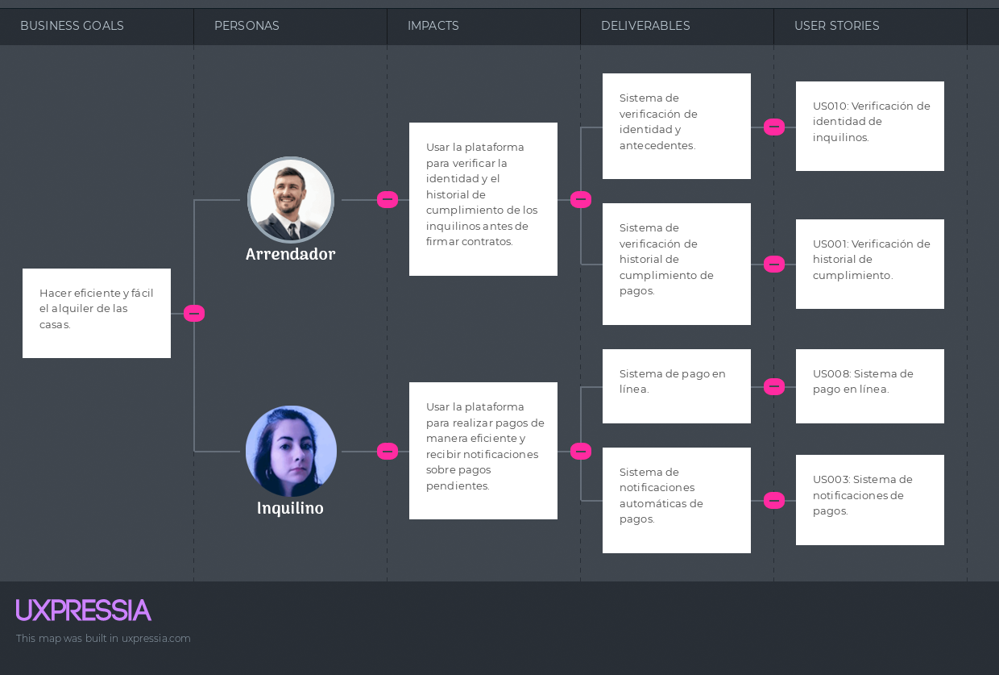
## 3.4. Product Backlog.

##### _Desarrollo del Product Backlog_

<table border = "1">
  <thead>
    <tr>
      <th>#Orden</th>
      <th>User Story ID</th>
      <th>Título</th>
      <th>Descripción (Como... Quiero... Para...)</th>
      <th>Story Points</th>
    </tr>
  </thead>
  <tbody>
    <tr>
      <td>1</td>
      <td>US-01</td>
      <td>Registro de usuario</td>
      <td>Como usuario, deseo registrarme en la plataforma para acceder a sus servicios.</td>
      <td>2</td>
    </tr>
    <tr>
      <td>2</td>
      <td>US-02</td>
      <td>Login de usuario</td>
      <td>Como usuario, deseo iniciar sesión en la plataforma para acceder a mis propiedades y contratos.</td>
      <td>2</td>
    </tr>
    <tr>
      <td>3</td>
      <td>US-05</td>
      <td>Búsqueda de propiedades</td>
      <td>Como inquilino, quiero buscar propiedades filtradas por ubicación, precio y características.</td>
      <td>3</td>
    </tr>
    <tr>
      <td>4</td>
      <td>US-04</td>
      <td>Publicar propiedad</td>
      <td>Como arrendador, quiero publicar mi propiedad en la plataforma para atraer inquilinos potenciales.</td>
      <td>3</td>
    </tr>
    <tr>
      <td>5</td>
      <td>US-06</td>
      <td>Ver detalles de propiedad</td>
      <td>Como inquilino, quiero ver los detalles completos de una propiedad para evaluar si me interesa.</td>
      <td>2</td>
    </tr>
    <tr>
      <td>6</td>
      <td>US-07</td>
      <td>Agendar visita a propiedad</td>
      <td>Como inquilino, quiero agendar una visita a una propiedad directamente desde la plataforma.</td>
      <td>3</td>
    </tr>
    <tr>
      <td>7</td>
      <td>US-10</td>
      <td>Firma de contrato digital</td>
      <td>Como usuario, quiero firmar el contrato de alquiler digitalmente para mayor conveniencia.</td>
      <td>3</td>
    </tr>
    <tr>
      <td>8</td>
      <td>US-08</td>
      <td>Comunicación con el arrendador</td>
      <td>Como inquilino, quiero comunicarme con el arrendador a través de la plataforma para hacer consultas.</td>
      <td>2</td>
    </tr>
    <tr>
      <td>9</td>
      <td>US-03</td>
      <td>Recuperar contraseña</td>
      <td>Como usuario, deseo recuperar mi contraseña en caso de olvidarla.</td>
      <td>2</td>
    </tr>
    <tr>
      <td>10</td>
      <td>US-09</td>
      <td>Verificación del historial del inquilino</td>
      <td>Como arrendador, quiero verificar el historial de pagos del inquilino antes de firmar un contrato.</td>
      <td>5</td>
    </tr>
    <tr>
      <td>11</td>
      <td>US-11</td>
      <td>Pago de alquiler</td>
      <td>Como inquilino, quiero realizar pagos automáticos del alquiler desde la plataforma.</td>
      <td>5</td>
    </tr>
    <tr>
      <td>12</td>
      <td>US-12</td>
      <td>Recordatorio de pago</td>
      <td>Como inquilino, quiero recibir recordatorios de pago para evitar retrasos en el alquiler.</td>
      <td>2</td>
    </tr>
    <tr>
      <td>13</td>
      <td>US-13</td>
      <td>Solicitud de mantenimiento</td>
      <td>Como inquilino, quiero solicitar mantenimiento a través de la plataforma para problemas en la propiedad.</td>
      <td>3</td>
    </tr>
    <tr>
      <td>14</td>
      <td>US-14</td>
      <td>Gestión de solicitudes de mantenimiento</td>
      <td>Como arrendador, quiero gestionar las solicitudes de mantenimiento de mis inquilinos.</td>
      <td>5</td>
    </tr>
    <tr>
      <td>15</td>
      <td>US-15</td>
      <td>Eliminar cuenta</td>
      <td>Como usuario, quiero eliminar mi cuenta de la plataforma si ya no deseo utilizar el servicio.</td>
      <td>1</td>
    </tr>
  </tbody>
</table>

---

# Capítulo IV: Strategic-Level Software Design
## 4.1. Strategic-Level Attribute-Driven Design
En este apartado, se presenta una serie de enfoques cruciales en el proceso de Diseño Dirigido por el Dominio a nivel estratégico. Estos enfoques resultaron esenciales para crear una base sólida en la definición y modelado de dominios complejos. A través de metodologías como Event Storming, Context Mapping y la definición de la Arquitectura de Software, se alcanzó una comprensión detallada de los elementos clave necesarios para el desarrollo de sistemas efectivos y bien estructurados. A continuación, se describen los puntos más importantes tratados en esta sección.
### 4.1.1. Design Purpose
El propósito del diseño de CasaFinder es desarrollar una plataforma avanzada que facilite de manera eficiente la conexión entre propietarios de inmuebles y personas que buscan alquilar, ya sea de forma temporal o permanente. Lo que diferencia a CasaFinder es su innovadora integración de la tecnología blockchain, que garantiza la transparencia, seguridad y el cumplimiento de los contratos de alquiler, al tiempo que crea un historial de alquileres inmutable y confiable para ambas partes.
### 4.1.2. Attribute-Driven Design Inputs
Se trata de factores esenciales que orientan el diseño de un sistema o plataforma. Estos atributos son cualidades específicas consideradas cruciales para el éxito del diseño, influyendo en las decisiones tomadas a lo largo del proceso de desarrollo. Los insumos del diseño impulsado por atributos ayudan a establecer los requisitos y prioridades del diseño, además de guiar las decisiones sobre la arquitectura, las funcionalidades y las características del sistema.
#### 4.1.2.1. Primary Functionality (Primary User Stories)
En el diseño de la plataforma, se han identificado varias funcionalidades clave que son esenciales para su operación y eficiencia. Estas incluyen la verificación del historial de pagos del inquilino, que permite a los propietarios evaluar la fiabilidad de los inquilinos antes de firmar un contrato; la firma de contratos de alquiler digitalmente, que ofrece una mayor conveniencia tanto para inquilinos como para propietarios; un sistema de pago automático de alquileres, que facilita las transacciones recurrentes y asegura la comodidad en los pagos; y un sistema de recordatorios de pago, que ayuda a evitar retrasos y asegura que los inquilinos cumplan con sus obligaciones a tiempo. Cada una de estas funcionalidades tiene un impacto significativo en la arquitectura de la solución, requiriendo sistemas robustos y seguros para manejar datos sensibles y proporcionar una experiencia de usuario fluida y confiable. Las siguientes historias de usuario se consideran de mayor importancia:

| **Epica / User Story ID** | **Título**                     | **Descripción**                                                                                                                                                            | **Criterios de Aceptación**                                                                                                                                                                                                                                            | **Relacionado con Epica (ID)** |
|---------------------------|--------------------------------|-----------------------------------------------------------------------------------------------------------------------------------------------------------------------------|----------------------------------------------------------------------------------------------------------------------------------------------------------------------------------------------------------------------------------------------------------------------|--------------------------------|
| US-09                     | Verificación del historial del inquilino | Como arrendador, quiero verificar el historial de pagos del inquilino antes de firmar un contrato.                                                                            | 1. Dado que estoy considerando alquilar mi propiedad, cuando solicito el historial del inquilino, entonces debería poder revisar su historial de cumplimiento de pagos.                                                                                                 | EP-05                          |
| US-10                     | Firma de contrato digital       | Como usuario, quiero firmar el contrato de alquiler digitalmente para mayor conveniencia.                                                                                     | 1. Dado que estoy listo para firmar el contrato, cuando lo reviso en la plataforma, entonces debería poder firmarlo electrónicamente y recibir una copia para ambas partes.                                                                                            | EP-05                          |
| US-11                     | Pago de alquiler                | Como inquilino, quiero realizar pagos automáticos del alquiler desde la plataforma.                                                                                           | 1. Dado que se acerca la fecha de pago, cuando programo el pago automático, entonces debería procesarse y recibir una notificación de confirmación de pago exitoso.                                                                                                    | EP-06                          |
| US-12                     | Recordatorio de pago            | Como inquilino, quiero recibir recordatorios de pago para evitar retrasos en el alquiler.                                                                                     | 1. Dado que la fecha de pago se aproxima, cuando falten pocos días, entonces debería recibir un recordatorio por correo o notificación para realizar el pago.                                                                                                        | EP-06                          |

#### 4.1.2.2. Quality attribute Scenarios
Basándonos en las historias de usuario seleccionadas, hemos enfocado nuestra atención en cuatro atributos de calidad críticos que son esenciales para la arquitectura y operación de nuestra plataforma. Estos atributos son:
•	Seguridad
•	Rendimiento
•	Usabilidad
•	Disponibilidad
Cada uno de estos atributos ha sido cuidadosamente seleccionado para asegurar que nuestra plataforma no solo cumpla con las necesidades funcionales de los usuarios, sino que también brinde una experiencia robusta y segura. A continuación, presentamos la tabla de Quality Attribute Scenarios (QAS), la cual nos permite caracterizar y evaluar estos aspectos de calidad para su implementación y optimización en el diseño arquitectónico de la solución.

 | Atributo     | Fuente         | Estímulo                         | Artefacto       | Entorno              | Respuesta                                                                                                                                                       | Medida                                   |
|--------------|----------------|----------------------------------|-----------------|----------------------|----------------------------------------------------------------------------------------------------------------------------------------------------------------|------------------------------------------|
| Seguridad    | Usuario        | Realizar un pago de alquiler     | Sistema de pago | Plataforma web       | El sistema procesa el pago a través de un gateway seguro, usando encriptación.                                                                                 | Ningún dato de compromiso; transacciones seguras registradas. |
| Rendimiento  | Usuario        | Solicitar historial de cumplimiento | Base de datos   | Acceso web en horas pico | El sistema recupera y muestra el historial dentro de los 3 segundos, incluso bajo carga.                                                                     | Tiempo de respuesta no supera los 3 segundos en horas pico.   |
| Usabilidad   | Nuevo usuario  | Registrarse en la plataforma     | Proceso de registro | Interfaz de usuario web | El sistema guía al usuario a través de un proceso de registro directo.                                                                                        | Más del 90% de los usuarios se registran en < 5 minutos.      |
| Disponibilidad | Usuario      | Acceder a notificaciones         | Sistema de notificaciones | Plataforma web       | El sistema notifica de manera confiable las notificaciones cada vez que se accede al perfil.                                                                  | Disponibilidad del sistema del 90%.                           |

#### 4\.1.2.3. Constraints
En la fase de desarrollo de nuestro proyecto de software, resulta crucial identificar y especificar claramente las restricciones que impactarán en el diseño, implementación y operación del sistema. A continuación, se describirán detalladamente cada una de estas restricciones.

| **Technical Story ID** | **Título**              | **Descripción**                                               | **Criterios de Aceptación**                                                                                                       | **Epic ID** |
|------------------------|-------------------------|---------------------------------------------------------------|-----------------------------------------------------------------------------------------------------------------------------------|------------|
| TS01                   | Uso de Spring Boot JPA  | Se debe utilizar Spring Boot JPA para la implementación del backend.  | Escenario 1: Verificación del Uso de Spring Boot JPA   Dado que un desarrollador está implementando el backend,   Cuando revise el código,   Entonces debe confirmar que se utiliza Spring Boot JPA. | 1          |
| TS02                   | Implementación de PostgreSQL | PostgreSQL será la base de datos exclusiva del proyecto.      | Escenario 1: Verificación de Conexión a PostgreSQL   Dado que la base de datos necesita estar operativa,   Cuando se configure el backend,   Entonces se debe utilizar PostgreSQL como base de datos. | 1          |
| TS03                   | Desarrollo con React Native | El frontend debe ser desarrollado usando React Native.        | Escenario 1: Uso Exclusivo de React Native en el Frontend   Dado que se requiere un frontend móvil,   Cuando se revise el código del frontend,   Entonces debe confirmarse que se usa React Native.  | 1          |
| TS04                   | Límite de Tiempo de Desarrollo | El proyecto debe estar completo y desplegado en 3 meses.      | Escenario 1: Cumplimiento de los Plazos de Desarrollo   Dado que el proyecto comienza,   Cuando transcurran 3 meses,   Entonces el sistema debe estar completamente desplegado y operativo.          | 1          |
| TS05                   | Uso de GitHub Organization   | Se debe utilizar GitHub Organization para el manejo del repositorio. | Escenario 1: Configuración de GitHub Organization   Dado que se está configurando el control de versiones,   Cuando se cree el repositorio,   Entonces debe hacerse dentro de una GitHub Organization. | 1          |

### 4.1.3. Architectural Drivers Backlog
Esta sección del proyecto cataloga los drivers clave que guían el diseño arquitectónico, organizados por su importancia y complejidad técnica. Este registro incluye Functional Drivers, Quality Attribute Drivers, y Constraints, estableciendo una hoja de ruta clara para priorizar el desarrollo y asegurar la alineación con las expectativas de los stakeholders. 

| **DRIVER ID** | **Título**                 | **Descripción**                                                                 | **Importancia para Stakeholders** | **Impacto en la Complejidad Técnica de la Arquitectura** | **Tipo**                   |
|---------------|----------------------------|---------------------------------------------------------------------------------|-----------------------------------|----------------------------------------------------------|---------------------------|
| DR01          | Seguridad de Transacciones | Garantizar la seguridad en todas las transacciones financieras dentro del sistema. | Alta                              | Alta                                                     | Quality Attribute Driver  |
| DR02          | Escalabilidad del Sistema  | El sistema debe soportar un aumento significativo en el número de usuarios sin degradar el rendimiento. | Alta                              | Alta                                                     | Quality Attribute Driver  |
| DR03          | Integración de Base de Datos | Integrar PostgreSQL de manera eficiente para manejar grandes volúmenes de datos.  | Media                             | Alta                                                     | Functional Driver         |
| DR04          | Interfaz de Usuario Responsive | Desarrollar una interfaz de usuario que se adapte a diferentes dispositivos y tamaños de pantalla.     | Media                             | Media                                                    | Quality Attribute Driver  |
| DR05          | Compatibilidad de Dispositivos | Asegurar que la aplicación funcione correctamente en varios dispositivos y plataformas.                 | Baja                              | Media                                                    | Quality Attribute Driver  |
| DR06          | Mantenimiento del Sistema   | Facilitar el mantenimiento y actualizaciones futuras del sistema sin interrupciones mayores.            | Baja                              | Baja                                                     | Constraint                |

### 4.1.4. Architectural Design Decisions
El cuadro de Architectural Design Decisions facilita una comparación visual y estructurada de los patrones arquitectónicos MVC, Microservices, y Event-Driven Architecture contra los Architectural Drivers del proyecto. Sirve para evaluar los pros y contras de cada patrón, ayudando a tomar decisiones informadas sobre el diseño arquitectónico que mejor alinee con las necesidades y desafíos específicos del sistema. 

| **DRIVER ID** | **Título del Driver**       | **Pattern 1: MVC**                                                                                                 | **Pattern 2: Microservices**                                                                                                | **Pattern 3: Event-Driven Architecture**                                    |
|---------------|-----------------------------|--------------------------------------------------------------------------------------------------------------------|-----------------------------------------------------------------------------------------------------------------------------|----------------------------------------------------------------------------|
| DR01          | Seguridad de Transacciones  | **Pro:** Facilita una estructura organizada para implementar controles de seguridad específicos.   **Con:** La interacción entre componentes puede complicar la gestión de la seguridad. | **Pro:** Cada servicio puede tener sus propias políticas de seguridad, mejorando la seguridad en granularidad.   **Con:** Requiere una gestión de seguridad compleja y coordinada entre servicios. | **Pro:** Los eventos pueden ser monitorizados y gestionados para seguridad en tiempo real.   **Con:** La asincronía y la distribución pueden introducir puntos vulnerables si no se manejan adecuadamente. |
| DR02          | Escalabilidad del Sistema   | **Pro:** Baja dependencia entre componentes facilita la escalabilidad horizontal de la interfaz de usuario.   **Con:** Las operaciones backend complejas pueden ser menos escalables en MVC tradicional. | **Pro:** Escalabilidad inherente al permitir escalar servicios de manera independiente.   **Con:** La complejidad de manejar múltiples servicios puede afectar el rendimiento.              | **Pro:** Naturalmente apto para escalabilidad dado que los componentes reaccionan a eventos, no a peticiones directas.   **Con:** La coordinación de eventos a gran escala necesita infraestructura robusta y bien configurada. |
| DR03          | Integración de Base de Datos | **Pro:** Estructura clara para la integración y migración de bases de datos.   **Con:** Puede ser inflexible para cambios rápidos en esquemas de base de datos.                    | **Pro:** Cada microservicio puede usar su base de datos optimizada para sus necesidades.   **Con:** La sincronización entre diferentes bases de datos puede ser desafiante.              | **Pro:** Permite reaccionar a cambios en la base de datos en tiempo real.   **Con:** Requiere middleware robusto para gestionar eventos de la base de datos eficientemente. |
| DR04          | Interfaz de Usuario Responsive | **Pro:** Separación de la lógica de negocio y la presentación favorece adaptabilidad a diferentes dispositivos.   **Con:** Puede requerir más trabajo para asegurar la respuesta en todos los dispositivos. | **Pro:** Puede servir diferentes interfaces optimizadas para distintos dispositivos desde diferentes servicios.   **Con:** La consistencia de la interfaz entre servicios puede ser un desafío. | **Pro:** Interfaces pueden actualizar en tiempo real respondiendo a eventos del sistema.   **Con:** El diseño debe asegurar que los eventos no sobrecarguen al cliente con actualizaciones demasiado frecuentes. |
| DR05          | Compatibilidad de Dispositivos | **Pro:** Facilita la creación de interfaces que funcionan en múltiples dispositivos al separar frontend y backend.   **Con:** Requiere pruebas exhaustivas para garantizar la compatibilidad. | **Pro:** Independencia del dispositivo ya que cada servicio puede ser consumido por cualquier cliente compatible.   **Con:** Requiere más gestión de endpoints y versiones de API. | **Pro:** Los eventos pueden ser consumidos por cualquier dispositivo suscrito, facilitando la compatibilidad.   **Con:** Depende de la capacidad del dispositivo para manejar flujos de eventos en tiempo real. |
| DR06          | Mantenimiento del Sistema    | **Pro:** Modularidad facilita el mantenimiento y actualizaciones del sistema.   **Con:** Las dependencias entre modelos, vistas y controladores pueden complicar el mantenimiento. | **Pro:** Facilita el mantenimiento al permitir actualizar servicios de manera independiente.   **Con:** La gestión de múltiples servicios y sus interdependencias puede complicar el mantenimiento. | **Pro:** Permite actualizaciones en tiempo real y es adaptable a cambios con mínimas interrupciones.   **Con:** La complejidad de la arquitectura puede requerir herramientas especializadas para mantenimiento. |

### 4.1.5. Quality Attribute Scenario Refinements
Los Quality Attribute Scenario Refinements detallan cómo el sistema debe manejar requisitos clave de seguridad, rendimiento, usabilidad y disponibilidad. Estos refinamientos son esenciales para asegurar que la arquitectura del sistema cumpla con las expectativas de los usuarios y los objetivos del negocio, facilitando decisiones de diseño informadas y centradas en los atributos más críticos para el éxito del proyecto. 

<table>
<tr>
<th colspan="3" valign="top"><b>Scenario Refinement for Scenario 1</b></th>
</tr>
<tr>
<td colspan="2" valign="top">Scenario</td>
<td colspan="1" valign="top">Como inquilino, quiero realizar pagos de alquiler de forma segura para evitar fraudes o robos de información.</td>
</tr>
<tr>
<td colspan="2" valign="top">Business Goals</td>
<td colspan="1" valign="top">Asegurar la confianza y protección de la información financiera de los usuarios.</td>
</tr>
<tr>
<td colspan="2" valign="top">Relevant Quality Attribute</td>
<td colspan="1" valign="top">Seguridad</td>
</tr>
<tr>
<td colspan="1" rowspan="6" valign="top">Scenario Components</td>
<td colspan="1" valign="top">Stimulus</td>
<td colspan="1" valign="top">Usuario realiza un pago de alquiler.</td>
</tr>
<tr>
<td colspan="1" valign="top">Stimulus Source</td>
<td colspan="1" valign="top">Interfaz de usuario en la plataforma web.</td>
</tr>
<tr>
<td colspan="1" valign="top">Environment</td>
<td colspan="1" valign="top">Sistema de pago en línea.</td>
</tr>
<tr>
<td colspan="1" valign="top">Artifact (if known)</td>
<td colspan="1" valign="top">Proceso de pago seguro.</td>
</tr>
<tr>
<td colspan="1" valign="top">Response</td>
<td colspan="1" valign="top">El sistema procesa el pago a través de un gateway seguro, usando encriptación.</td>
</tr>
<tr>
<td colspan="1" valign="top">Response Measure</td>
<td colspan="1" valign="top">Ningún dato de pago es comprometido; todas las transacciones se registran de manera segura.</td>
</tr>
<tr>
<td colspan="2" valign="top">Questions</td>
<td colspan="1" valign="top">¿Cómo se asegura la plataforma que los gateways de pago son seguros?</td>
</tr>
<tr>
<td colspan="2" valign="top">Issues</td>
<td colspan="1" valign="top">Revisar regularmente las normativas de seguridad para cumplir con estándares internacionales.</td>
</tr>
</table>

<table>
<tr>
<th colspan="3" valign="top"><b>Scenario Refinement for Scenario 2</b></th>
</tr>
<tr>
<td colspan="2" valign="top">Scenario</td>
<td colspan="1" valign="top">Como propietario, quiero solicitar el historial de cumplimiento de un inquilino rápidamente para tomar decisiones de arrendamiento informadas.</td>
</tr>
<tr>
<td colspan="2" valign="top">Business Goals</td>
<td colspan="1" valign="top">Mejorar la eficiencia operativa y satisfacción del cliente.</td>
</tr>
<tr>
<td colspan="2" valign="top">Relevant Quality Attribute</td>
<td colspan="1" valign="top">Rendimiento</td>
</tr>
<tr>
<td colspan="1" rowspan="6" valign="top">Scenario Components</td>
<td colspan="1" valign="top">Stimulus</td>
<td colspan="1" valign="top">Usuario solicita el historial de cumplimiento de un inquilino.</td>
</tr>
<tr>
<td colspan="1" valign="top">Stimulus Source</td>
<td colspan="1" valign="top">Interfaz de usuario en la plataforma web.</td>
</tr>
<tr>
<td colspan="1" valign="top">Environment</td>
<td colspan="1" valign="top">Base de datos de historiales en horas pico.</td>
</tr>
<tr>
<td colspan="1" valign="top">Artifact (if known)</td>
<td colspan="1" valign="top">Sistema de gestión de base de datos.</td>
</tr>
<tr>
<td colspan="1" valign="top">Response</td>
<td colspan="1" valign="top">El sistema recupera y muestra el historial en menos de 3 segundos.</td>
</tr>
<tr>
<td colspan="1" valign="top">Response Measure</td>
<td colspan="1" valign="top">Tiempo de respuesta no supera los 3 segundos en horas pico.</td>
</tr>
<tr>
<td colspan="2" valign="top">Questions</td>
<td colspan="1" valign="top">¿Cuáles son las tecnologías de base de datos empleadas para optimizar el rendimiento?</td>
</tr>
<tr>
<td colspan="2" valign="top">Issues</td>
<td colspan="1" valign="top">Monitorear y optimizar las consultas de base de datos durante las horas pico.</td>
</tr>
</table>

<table>
<tr>
<th colspan="3" valign="top"><b>Scenario Refinement for Scenario 3</b></th>
</tr>
<tr>
<td colspan="2" valign="top">Scenario</td>
<td colspan="1" valign="top">Como nuevo usuario, quiero registrarme en la plataforma de manera fácil y rápida para comenzar a utilizar el servicio sin complicaciones.</td>
</tr>
<tr>
<td colspan="2" valign="top">Business Goals</td>
<td colspan="1" valign="top">Aumentar la base de usuarios facilitando el acceso a la plataforma.</td>
</tr>
<tr>
<td colspan="2" valign="top">Relevant Quality Attribute</td>
<td colspan="1" valign="top">Usabilidad</td>
</tr>
<tr>
<td colspan="1" rowspan="6" valign="top">Scenario Components</td>
<td colspan="1" valign="top">Stimulus</td>
<td colspan="1" valign="top">Nuevo usuario se registra en la plataforma.</td>
</tr>
<tr>
<td colspan="1" valign="top">Stimulus Source</td>
<td colspan="1" valign="top">Página de registro en la interfaz web.</td>
</tr>
<tr>
<td colspan="1" valign="top">Environment</td>
<td colspan="1" valign="top">Proceso de registro.</td>
</tr>
<tr>
<td colspan="1" valign="top">Artifact (if known)</td>
<td colspan="1" valign="top">Formulario de registro.</td>
</tr>
<tr>
<td colspan="1" valign="top">Response</td>
<td colspan="1" valign="top">El sistema guía al usuario a través de un proceso de registro sencillo y directo.</td>
</tr>
<tr>
<td colspan="1" valign="top">Response Measure</td>
<td colspan="1" valign="top">Más del 90% de los usuarios completan el registro en menos de 5 minutos.</td>
</tr>
<tr>
<td colspan="2" valign="top">Questions</td>
<td colspan="1" valign="top">¿Cómo se manejan los errores de entrada durante el registro?</td>
</tr>
<tr>
<td colspan="2" valign="top">Issues</td>
<td colspan="1" valign="top">Asegurar que los mensajes de error sean claros y ayuden al usuario a corregir los problemas efectivamente.</td>
</tr>
</table>

<table>
<tr>
<th colspan="3" valign="top"><b>Scenario Refinement for Scenario 4</b></th>
</tr>
<tr>
<td colspan="2" valign="top">Scenario</td>
<td colspan="1" valign="top">Como usuario, quiero recibir notificaciones cuando haya cambios en el sistema para gestionar mis actividades de manera eficiente.</td>
</tr>
<tr>
<td colspan="2" valign="top">Business Goals</td>
<td colspan="1" valign="top">Mejorar la comunicación y la experiencia del usuario manteniéndolos informados de los cambios relevantes.</td>
</tr>
<tr>
<td colspan="2" valign="top">Relevant Quality Attribute</td>
<td colspan="1" valign="top">Disponibilidad</td>
</tr>
<tr>
<td colspan="1" rowspan="6" valign="top">Scenario Components</td>
<td colspan="1" valign="top">Stimulus</td>
<td colspan="1" valign="top">Usuario necesita ser notificado sobre cambios importantes en el sistema.</td>
</tr>
<tr>
<td colspan="1" valign="top">Stimulus Source</td>
<td colspan="1" valign="top">Interfaz de usuario en cualquier dispositivo.</td>
</tr>
<tr>
<td colspan="1" valign="top">Environment</td>
<td colspan="1" valign="top">Sistema de notificaciones.</td>
</tr>
<tr>
<td colspan="1" valign="top">Artifact (if known)</td>
<td colspan="1" valign="top">Servidor de notificaciones.</td>
</tr>
<tr>
<td colspan="1" valign="top">Response</td>
<td colspan="1" valign="top">El sistema muestra de manera confiable las notificaciones cada vez que se accede al perfil.</td>
</tr>
<tr>
<td colspan="1" valign="top">Response Measure</td>
<td colspan="1" valign="top">Disponibilidad del sistema del 90%.</td>
</tr>
<tr>
<td colspan="2" valign="top">Questions</td>
<td colspan="1" valign="top">¿Cómo se gestionan y priorizan las notificaciones para evitar sobrecarga informativa?</td>
</tr>
<tr>
<td colspan="2" valign="top">Issues</td>
<td colspan="1" valign="top">Implementar filtros y configuraciones personalizables para que los usuarios controlen las notificaciones que desean recibir.</td>
</tr>
</table>

## 4.2. Strategic-Level Domain-Driven Design.

### 4.2.1. EventStorming

Se adoptó un método colaborativo y visual para modelar el contexto del dominio. Se investigaron las fases de Candidate Context Discovery, Domain Message Flows Modeling y la creación de Bounded Context Canvases.

###### *Step 1: Unstructured Exploration*
 Se llevó a cabo la etapa inicial donde se exploraron ideas y se profundizó en el conocimiento del dominio del negocio, estableciendo así las bases para el modelado en las etapas subsiguientes.

###### *Step 2: Timelines, Step 3: Pain Points, Step 4: Pivotal Points*
Se identificaron tres etapas clave: "Timelines" para mapear la secuencia temporal de los eventos dentro del sistema, "Pain Points" para destacar y abordar los desafíos y dificultades dentro del proceso, y "Pivotal Points" que son momentos críticos que pueden influir significativamente en el diseño y la funcionalidad del sistema. 

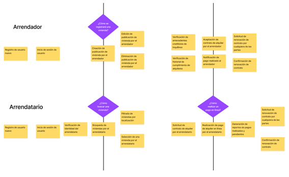

###### *Step 5: Commands, Step 6: Policies, Step 7: Read models, Step 8: External Systems*
Se delinearon cuatro componentes cruciales del diseño: Commands, que son acciones activadas por el usuario para influir en el sistema; Policies, reglas que guían las operaciones y mantienen la integridad del sistema; Read Models, estructuras que optimizan la recuperación y visualización de datos; y External Systems, que son servicios o plataformas externas integradas que amplían o soportan la funcionalidad del sistema. 

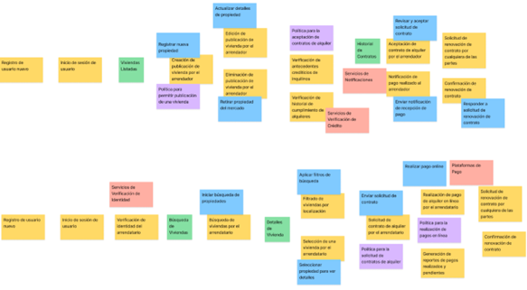

###### *Step 9: Aggregates, Step 10: Bounded Contexts*
Finalmente, se definieron dos elementos estructurales esenciales: Aggregates, que agrupan entidades y objetos relacionados para mantener la consistencia y las reglas de negocio, y Bounded Contexts, que delimitan claros contornos dentro del sistema donde los modelos de dominio aplican y se integran de manera coherente, asegurando que las interacciones entre diferentes partes del sistema sean gestionadas de forma eficaz.  

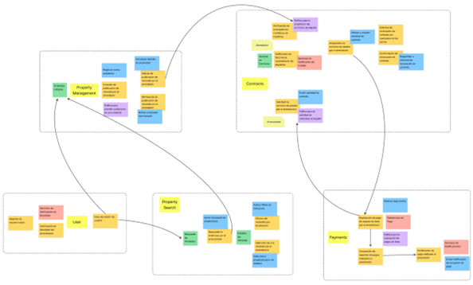

Enlace de Figma: [https://www.figma.com/design/Uc3NsOj4bLD0kn1V9fEQAS/EventStorming?node-id=0-1&t=yvJsImddBjaNskKb-1 ](https://www.figma.com/design/Uc3NsOj4bLD0kn1V9fEQAS/EventStorming?node-id=0-1&t=yvJsImddBjaNskKb-1 )

### 4.2.2. Candidate Context Discovery

Utilizando la metodología de eventstorming y centrados en la técnica de "start-with-simple", empleamos la línea de tiempo para identificar posibles candidatos para nuestro contexto delimitado, que incluyen los siguientes elementos. 

**Property Management:**
Este contexto gestiona todas las operaciones relacionadas con las propiedades listadas por los arrendadores. Incluye comandos como "Registrar nueva propiedad", "Actualizar detalles de propiedad", y "Retirar propiedad del mercado". Es fundamental para mantener la información de las propiedades actualizada y accesible, facilitando las operaciones de publicación y gestión de propiedades. Este contexto también interactúa con políticas internas para asegurar que todas las propiedades cumplan con los estándares requeridos antes de ser listadas. 

**Property Search:**
Este contexto permite a los arrendatarios buscar y filtrar propiedades según sus preferencias. Involucra comandos como "Iniciar búsqueda de propiedades" y "Aplicar filtros de búsqueda". Es crucial para proporcionar una experiencia de usuario eficiente, permitiendo a los arrendatarios encontrar rápidamente propiedades que se ajusten a sus necesidades. Este contexto podría interactuar con APIs externas que proporcionen datos adicionales de propiedades o recomendaciones personalizadas. 

**User:**
Este contexto se ocupa de la administración de usuarios, incluyendo su registro, autenticación, y gestión de perfiles. Los comandos clave incluyen "Registrar nuevo usuario" e "Iniciar sesión de usuario". Es esencial para la seguridad y personalización del sistema, asegurando que solo los usuarios autorizados puedan acceder y operar dentro de la plataforma. Utiliza servicios de verificación de identidad como sistemas externos para autenticar y validar la identidad de los usuarios. 

**Contracts:**
Este contexto abarca la gestión de contratos de alquiler entre arrendadores y arrendatarios. Incluye comandos para "Revisar y aceptar solicitudes de contrato" y "Responder a solicitudes de renovación de contrato". Este contexto se encarga de asegurar que todos los contratos cumplen con las normativas legales y las políticas de la plataforma, y utiliza sistemas externos como servicios de verificación de crédito para evaluar la solvencia de los arrendatarios.  

**Payments:**
Este contexto maneja todas las transacciones financieras relacionadas con el pago de alquileres. Incluye comandos para "Realizar pago online" y procesa eventos como "Realización de pago de alquiler en línea". Este contexto es vital para la gestión financiera dentro de la plataforma, asegurando transacciones seguras y eficientes a través de plataformas de pago externas y políticas que garantizan la conformidad con normativas de transacciones financieras.

### 4.2.3. Domain Message Flows Modeling

**Escenario 1: Alquiler de Vivienda para el Arrendatario**
Este flujo describe cómo un arrendatario inicia sesión en la plataforma usando su correo y contraseña, busca viviendas filtrando por ubicación y precio, solicita un contrato tras elegir una vivienda, y finaliza con la realización del pago del alquiler a través de plataformas de pago online, todo integrado con contratos inteligentes para asegurar transacciones seguras y automatizadas. 

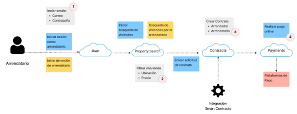

**Escenario 2: Alquiler de Vivienda para el Arrendador**
Este escenario ilustra cómo un arrendador ingresa a la plataforma utilizando su correo electrónico y contraseña, registra y publica nuevas viviendas con detalles como descripción, fotos, ubicación y precio, recibe solicitudes de alquiler de arrendatarios, y finalmente revisa y acepta dichas solicitudes de contrato, todo dentro de un sistema integrado que facilita la gestión eficiente de propiedades. 

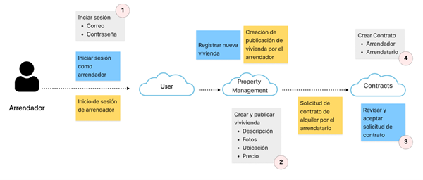

### 4.2.4. Bounded Context Canvases

**Contracts:**
En este Bounded Context de Contratos, se gestiona la creación, revisión y ejecución de acuerdos de alquiler, colaborando estrechamente con el Bounded Context de Property Search para recibir solicitudes de contrato. Este contexto es crucial para asegurar que tanto arrendadores como arrendatarios cumplan con las regulaciones y los términos establecidos, manteniendo un marco de transacciones seguras y confiables dentro de la plataforma.

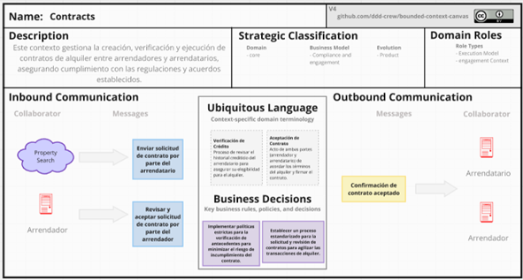

**Property Management:**
Este Bounded Context de Gestión de Propiedades se encarga de administrar todas las actividades relacionadas con las propiedades dentro de la plataforma. Coordina directamente con los arrendadores para el registro, actualización y eliminación de listados de propiedades, asegurando que cada propiedad cumpla con los estándares de calidad y políticas establecidas antes de su publicación. Este contexto juega un papel fundamental en mantener la integridad y la actualidad de las listas de propiedades disponibles para alquiler.

**Property Search:**
Este Bounded Context de Búsqueda de Propiedades facilita la exploración y selección de viviendas por parte de los arrendatarios, permitiéndoles aplicar diversos filtros como ubicación, precio y características específicas. La interacción principal ocurre con el contexto de Gestión de Propiedades para obtener detalles precisos y actualizados de cada listado. Este contexto es esencial para proporcionar una experiencia de búsqueda eficiente y personalizada a los usuarios, ayudándoles a encontrar rápidamente propiedades que satisfagan sus necesidades específicas. 

**Payments:**
Este Bounded Context de Pagos se encarga de gestionar todas las operaciones financieras relacionadas con los pagos de alquiler dentro de la plataforma. Esto incluye procesar pagos en línea, generar reportes detallados de las transacciones y asegurar la correcta notificación a los arrendadores sobre los pagos recibidos. Integrado con sistemas de pago externos y el contexto de Contratos, este contexto juega un papel crucial en la eficiencia y seguridad de las transacciones financieras, garantizando que todos los pagos se manejen de manera segura y conforme a las políticas establecidas. 

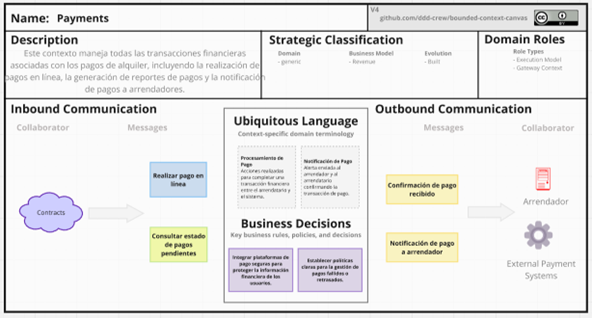

**User:**
Este Bounded Context de Usuario se ocupa de todas las funciones relacionadas con la gestión de usuarios en la plataforma, incluyendo el registro de nuevos usuarios, la autenticación y la verificación de la identidad de los arrendatarios. Asegura que solo usuarios autenticados y verificados puedan interactuar con el sistema, garantizando la seguridad y la integridad de las transacciones dentro de la plataforma. Este contexto es fundamental para mantener un entorno seguro y de confianza para todos los usuarios, facilitando una experiencia de usuario fluida y protegida. 

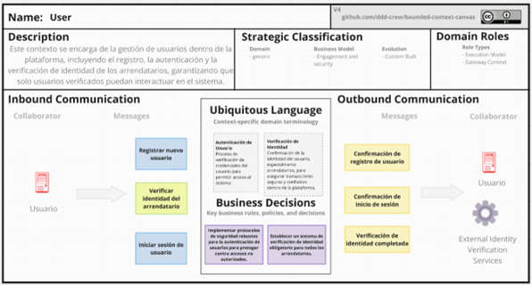

Enlace a Miro: [Bounded Context Canvases](https://miro.com/app/board/uXjVKhk8XkA=/?share_link_id=403115287333)

### 4.2.5. Context Mapping

Tras identificar nuestros Bounded Contexts, procedimos a definir las relaciones estructurales entre ellos. Para esta tarea, evaluamos diversos diseños candidatos para el Context Mapping, basándonos en los patrones de relaciones entre Bounded Contexts propuestos en el Domain-Driven Design. Empleamos la herramienta en línea DomoRoboto para crear el Context Mapping mostrado en la imagen siguiente: 

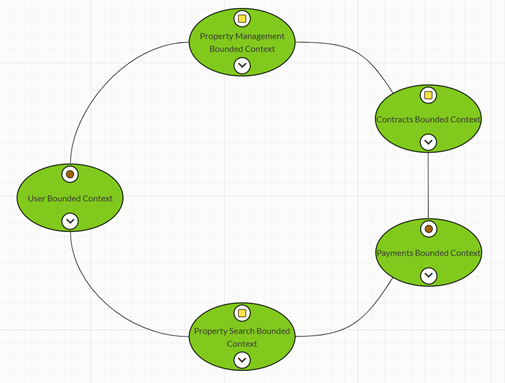
## 4.3. Software Architecture.

### 4.3.1. Software Architecture Context Level Diagrams.

El presente diagrama muestra la interacción del sistema CasaFinder con los usuarios y otros sistemas. Los usuarios son el arrendador y el arrendatario. El arrendador es una persona que busca poner en alquiler su casa, mientras que el arrendatario busca alquilar una casa. Los sistemas con los que interactúa son el sistema de email para enviar notificaciones y la plataforma de pagos para hacer depósitos y retiros.

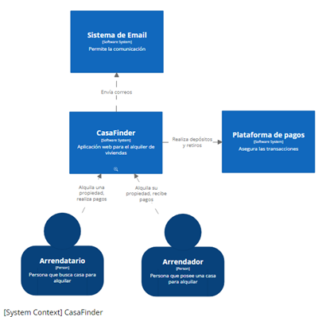
                                                  |
### 4.3.2. Software Architecture Container Level Diagrams.

El presente diagrama muestra el contenido del sistema CasaFinder. Los cuales son Landing Page, Aplicación web, API Rest y Base de datos. El landing page está desarrollado con HTML, CSS y Js, es un call-to-action para llamar la atención de ambos usuarios, fomentar la descarga y redirigir hacia la aplicación. La aplicación web está desarrollada con React y provee una interfaz didáctica con los usuarios y otros sistemas. El API Rest está desarrollado con Spring Boot y expone los endpoints para principalmente poner en alquiler casas. La base de datos está desarrollada con PostgreSql y se usa para el almacenamiento de todos los datos. Adicionalmente, se muestra la interacción del API Rest con el sistema de email para enviar notificaciones y con la plataforma de pagos para hacer depósitos y retiros.

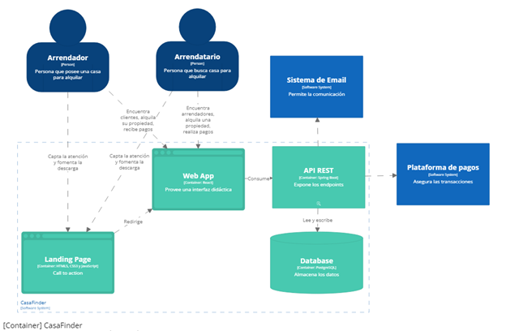

---
# Conclusiones

- Aquí van las conclusiones

---
# Recomendaciones

- Aquí van las recomendaciones

--- 
# Anexos
## Repositorio con Informe
Enlace: [Repositorio Trabajo Final](https://github.com/SmartRenta/CasaFinder-Report)
## Entrega TB1

Enlace: [Exposición TB1 en Microsoft Stream](https://upcedupe-my.sharepoint.com/:v:/g/personal/u201620605_upc_edu_pe/EWBiPPEEPFFFsihmfBnj8jABNbpo0ieaFZIQEiqCoG1NRg?nav=eyJyZWZlcnJhbEluZm8iOnsicmVmZXJyYWxBcHAiOiJPbmVEcml2ZUZvckJ1c2luZXNzIiwicmVmZXJyYWxBcHBQbGF0Zm9ybSI6IldlYiIsInJlZmVycmFsTW9kZSI6InZpZXciLCJyZWZlcnJhbFZpZXciOiJNeUZpbGVzTGlua0NvcHkifX0&e=X4fTIO)